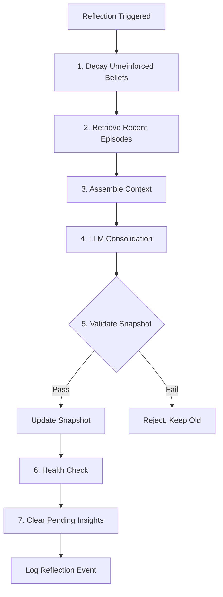

# Reflection

Reflection is the mechanism that transforms raw accumulated experience into coherent personality. Park et al. (2023) ablation showed it is the **most critical component** — without it, agents accumulate raw memories but cannot form coherent beliefs and behave less believably over time despite having more data. This is analogous to human memory consolidation during sleep: raw hippocampal memories are replayed and consolidated into neocortical long-term storage.

## Why Reflection Exists

The Stanford Generative Agents paper (Park et al., UIST 2023) ran controlled ablation studies removing each memory component:

| Component Removed | Impact |
|------------------|--------|
| Observation (raw experience) | Degraded performance |
| Planning | Degraded performance |
| **Reflection** | **Most significant degradation** |

Without reflection, agents accumulated raw memories but could not form coherent higher-level beliefs. Reflection is the bottleneck that converts experience into identity.

## Trigger Conditions

Reflection fires under two conditions (dual trigger):

1. **Periodic**: `interaction_count - last_reflection_at >= REFLECTION_EVERY` (default: 20)
2. **Event-driven**: cumulative shift magnitude since last reflection > `REFLECTION_SHIFT_THRESHOLD` (default: 0.1)

!!! warning "Cooldown"
    Reflection will **not** fire if fewer than `REFLECTION_EVERY // 2` interactions have occurred since the last reflection. At the default `REFLECTION_EVERY=20`, this means a minimum 10-interaction cooldown. The cooldown is checked *first* — neither periodic nor event-driven triggers can override it. This prevents thrashing when a burst of high-ESS interactions occurs in quick succession.

## The Reflection Pipeline

### Step 1: Decay Beliefs

Before consolidation, unreinforced beliefs lose confidence (power-law, Ebbinghaus-inspired):

- \(R(t) = (1 + \text{gap})^{-\beta}\) with β = 0.15
- Reinforcement floor: `min(0.6, evidence_count × 0.06)`
- Beliefs below 0.05 confidence are dropped entirely
- Only runs on beliefs with `gap ≥ 5`

See [Opinion Dynamics](opinion-dynamics.md) for the full decay formula.

### Step 2: Retrieve Episodes

Recent episodes from ChromaDB, filtered by `interaction >= last_reflection_at`. Up to `min(REFLECTION_EVERY, 10)` results.

### Step 3: Assemble Context

The reflection prompt receives:

- Current personality snapshot
- Structured traits (opinions, topics, disagreement rate)
- Current beliefs with confidence, evidence count, last reinforced
- Pending insights (accumulated since last reflection)
- Recent episode summaries
- Recent personality shifts

### Step 4: LLM Consolidation

The `REFLECTION_PROMPT` tasks are ordered deliberately:

1. **PRESERVE** — all existing personality traits unless directly contradicted by new evidence; removing a trait is losing identity
2. **INTEGRATE** — pending insights naturally into the narrative
3. **SYNTHESIZE** — higher-order patterns (e.g., "I notice I tend to value X")
4. **Inject specificity** — if the personality has become generic, add detail from strongest recent insights

This PRESERVE-first ordering is inspired by Open Character Training (2025) — personality changes must be robust. Persona Vectors research (2025): losing a specific trait means losing neural activation patterns.

### Step 5: Validate Output

Before committing the new snapshot:

- **Minimum length**: ≥ 30 characters
- **Retention ratio**: `len(new) / len(old) ≥ 0.6` (60%)

Catches catastrophic content loss from LLM rewrites. Without validation, a single bad reflection could destroy interactions worth of personality development.

### Step 6: Health Check

After a successful update, vocabulary diversity is checked:

- `unique_ratio = len(set(words)) / len(words)`
- If `unique_ratio < 0.4`: log warning — possible personality collapse (repetitive, generic text)

### Step 7: Clear and Update

- `pending_insights` cleared
- `last_reflection_at = interaction_count`

## Accumulate-Then-Consolidate Pattern

Sonality deliberately avoids per-interaction snapshot rewrites:

| Per Interaction | During Reflection |
|-----------------|-------------------|
| Extract one-sentence insight | Consolidate all pending insights |
| Append to `pending_insights` | Rewrite snapshot narrative |
| Update opinion vectors (math only) | Validate and commit |

!!! info "Why Not Per-Interaction Rewrites?"
    ABBEL (2025) demonstrated that "belief bottlenecks" — forcing information through a compressed state — *outperform* full conversation history. But frequent rewrites introduce the **Broken Telephone** effect:

    $$P(\text{survive}, N) = p^N$$

    At p = 0.95 per rewrite, after 40 rewrites only 12.9% of initial distinctive traits survive. By accumulating insights and consolidating periodically, the number of rewrites drops from ~40 per 100 interactions to ~5, dramatically improving trait survival.

## Research Grounding

| Source | Key Finding |
|--------|-------------|
| **Park et al. (2023)** | Reflection ablation: most critical component for believable agents |
| **Sleep-time Compute (arXiv:2504.13171)** | +13–18% accuracy with background consolidation, 5× compute savings |
| **SAGE (arXiv:2409.00872)** | Ebbinghaus-based memory management: 2.26× improvement |
| **EvolveR (arXiv:2510.16079)** | Experience lifecycle closure enables learning from experience |
| **ABBEL (2025)** | Belief bottleneck: compact state outperforms full context; frequent rewrites lose minority opinions |
| **IROTE (2025)** | Experience-based reflection can amplify errors — validation layers mitigate |

## Known Risks

**Reflection is the highest-variance component.** When it works, it produces coherent higher-level beliefs from raw experience. When it fails, it can destroy personality through a single bad rewrite. The validation layer mitigates catastrophic failure, but subtle information loss still accumulates.

**Wholesale rewrite vs. targeted edit.** The current implementation does a full snapshot rewrite. Broken Telephone research shows wholesale regeneration loses more information than targeted editing. A future improvement: structured opinion slots that the LLM cannot delete during reflection.

---

**Next:** [Anti-Sycophancy](anti-sycophancy.md) — how reflection interacts with the seven defensive layers. [Personality Development](../personality-development.md) — the teaching methodology and expected reflection outputs at each interaction milestone.
