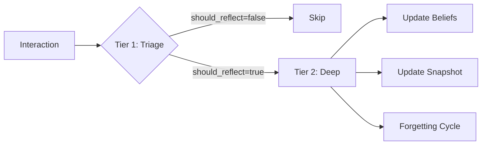

# Reflection

Transforms raw experience into coherent beliefs via two-tier LLM assessment.

## Architecture


```mermaid
flowchart LR
    Interaction --> Triage{Tier 1: Triage}
    Triage -->|should_reflect=false| Skip[Skip]
    Triage -->|should_reflect=true| Deep[Tier 2: Deep]
    Deep --> Beliefs[Update Beliefs]
    Deep --> Snapshot[Update Snapshot]
    Deep --> Forget[Forgetting Cycle]
```

## Tier 1: Triage

Lightweight LLM check per interaction. Decides if deeper reflection is warranted.

**Input:** Current beliefs, user message, ESS result  
**Output:** `{"should_reflect": bool, "reason": str}`

**Criteria:**
- Evidence that changes existing beliefs?
- New topic requiring a stance?
- Shift in reasoning patterns?

Most interactions return `should_reflect=false` quickly.

## Tier 2: Deep Reflection

Full context analysis when triage approves.

**Input:** Personality snapshot, beliefs, recent episodes (≤10), triggering interaction

**Tasks:**
1. **EVALUATE** — Which beliefs change?
2. **RECONCILE** — Resolve belief tensions
3. **SYNTHESIZE** — Meta-patterns, snapshot evolution

**Output:**
```python
class _DeepReflectionResponse(BaseModel):
    belief_updates: list[_BeliefPatch]  # topic, valence, confidence, belief_text
    new_beliefs: list[_BeliefPatch]
    snapshot_revision: str
    snapshot_changed: bool
```

## Application

```python
# Beliefs → Neo4j
for patch in belief_updates + new_beliefs:
    await graph.upsert_belief(patch.topic, valence=patch.valence, ...)

# Snapshot → Neo4j (if changed)
if snapshot_changed:
    await graph.upsert_personality_snapshot(snapshot_revision)

# Trigger forgetting
candidates = await graph.get_forgetting_candidates(limit=10)
await assess_and_forget(candidates, ...)
```

## Execution

Runs in background worker thread — responses are not blocked.

## Research

| Source | Finding |
|--------|---------|
| Park et al. (2023) | Reflection is most critical component |
| ABBEL (2025) | Compact belief bottleneck outperforms full context |
