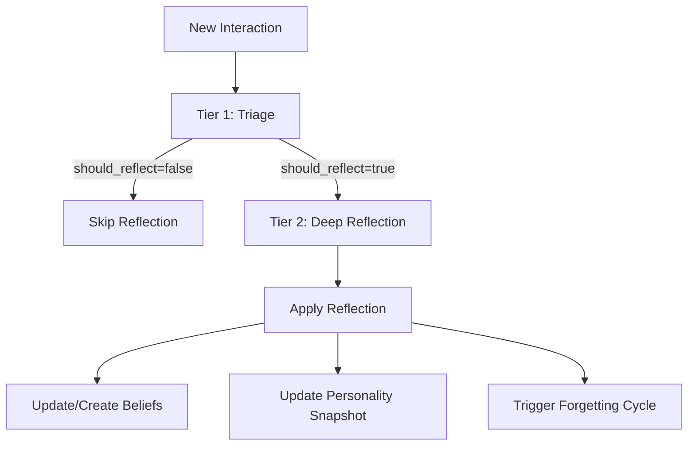
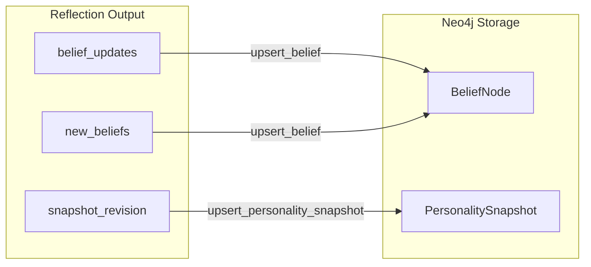
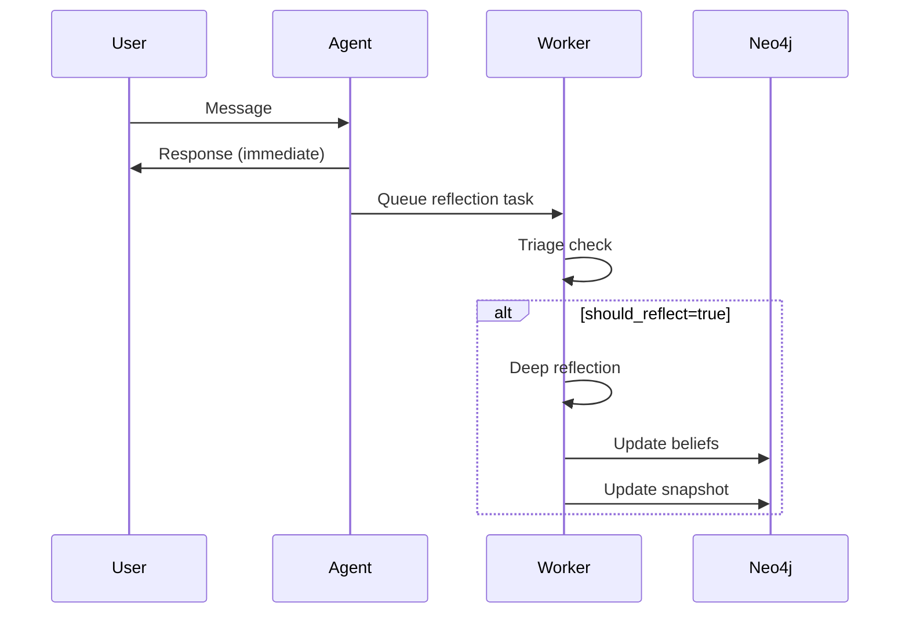

# Reflection

Reflection is the mechanism that transforms raw accumulated experience into coherent personality. Park et al. (2023) ablation showed it is the **most critical component** — without it, agents accumulate raw memories but cannot form coherent beliefs and behave less believably over time despite having more data.

## Why Reflection Exists

The Stanford Generative Agents paper (Park et al., UIST 2023) ran controlled ablation studies removing each memory component:

| Component Removed | Impact |
|------------------|--------|
| Observation (raw experience) | Degraded performance |
| Planning | Degraded performance |
| **Reflection** | **Most significant degradation** |

Without reflection, agents accumulated raw memories but could not form coherent higher-level beliefs. Reflection is the bottleneck that converts experience into identity.

## Two-Tier Reflection Architecture

Sonality uses an LLM-driven two-tier reflection system that evaluates each interaction:


```mermaid
flowchart TD
    Interaction[New Interaction] --> Triage[Tier 1: Triage]
    Triage -->|should_reflect=false| Skip[Skip Reflection]
    Triage -->|should_reflect=true| Deep[Tier 2: Deep Reflection]
    
    Deep --> Apply[Apply Reflection]
    Apply --> UpdateBeliefs[Update/Create Beliefs]
    Apply --> UpdateSnapshot[Update Personality Snapshot]
    Apply --> Forgetting[Trigger Forgetting Cycle]
```

### Tier 1: Triage

Every conversation triggers a lightweight LLM triage that decides whether deeper reflection is warranted.

**Triage Input:**
- Current top beliefs (topic, valence, confidence)
- User message and agent response
- ESS classification (score, reasoning type, topics)

**Triage Decision Criteria:**
1. Does this contain evidence that changes existing beliefs?
2. Does it introduce a genuinely new topic requiring a stance?
3. Does it represent a shift in how the agent reasons?

**Output:** `{"should_reflect": true/false, "reason": "..."}`

```python
class _TriageResponse(BaseModel):
    should_reflect: bool = False
    reason: str = ""
```

### Tier 2: Deep Reflection

When triage returns `should_reflect=true`, the agent performs deep reflection with full context.

**Deep Reflection Input:**
- Current personality snapshot
- Current beliefs with valence/confidence
- Recent episodes (up to 10)
- The triggering interaction

**Deep Reflection Tasks:**
1. **EVALUATE** — Which beliefs should change based on new evidence?
2. **RECONCILE** — Check for tensions between beliefs, acknowledge/resolve conflicts
3. **SYNTHESIZE** — What meta-patterns emerge? Should the personality snapshot evolve?

**Output:**

```python
class _BeliefPatch(BaseModel):
    topic: str = ""
    valence: float = 0.0        # -1 to +1
    confidence: float = 0.5     # 0 to 1
    belief_text: str = ""       # natural language belief
    reasoning: str = ""         # why this update

class _DeepReflectionResponse(BaseModel):
    belief_updates: list[_BeliefPatch] = []
    new_beliefs: list[_BeliefPatch] = []
    snapshot_revision: str = ""
    snapshot_changed: bool = False
```

## Applying Reflection

After deep reflection produces a response, the agent applies changes:


```mermaid
flowchart LR
    subgraph changes["Reflection Output"]
        Updates[belief_updates]
        NewBeliefs[new_beliefs]
        Snapshot[snapshot_revision]
    end
    
    subgraph storage["Neo4j Storage"]
        BeliefNodes[BeliefNode]
        SnapshotNode[PersonalitySnapshot]
    end
    
    Updates -->|upsert_belief| BeliefNodes
    NewBeliefs -->|upsert_belief| BeliefNodes
    Snapshot -->|upsert_personality_snapshot| SnapshotNode
```

### Belief Updates

Each belief patch creates or updates a `BeliefNode` in Neo4j:

```python
for patch, provenance in all_updates:
    await graph.upsert_belief(
        patch.topic,
        valence=patch.valence,
        confidence=patch.confidence,
        belief_text=patch.belief_text,
        provenance=provenance,  # "reflection:{episode_uid}" or "new_belief:{episode_uid}"
    )
```

### Snapshot Updates

If `snapshot_changed=true`, the personality snapshot is updated:

```python
if reflection.snapshot_changed and reflection.snapshot_revision:
    text = reflection.snapshot_revision[:2000]  # truncate safety
    await graph.upsert_personality_snapshot(text)
```

## Integration with Forgetting

After applying reflection, the agent triggers a forgetting cycle on candidate episodes:

```python
candidates = await graph.get_forgetting_candidates(limit=10)
if candidates:
    snapshot = await graph.get_personality_snapshot()
    await assess_and_forget(
        candidates, graph, dual_store,
        snapshot_excerpt=snapshot.text[:500],
    )
```

This ensures that:
1. New beliefs are formed from important interactions
2. Redundant or outdated episodes are archived/forgotten
3. The memory system stays coherent with current beliefs

## Why Per-Interaction Triage?

Unlike periodic reflection approaches, Sonality evaluates every interaction:

| Approach | Pros | Cons |
|----------|------|------|
| **Periodic** (every N interactions) | Lower compute | May miss important moments |
| **Threshold** (ESS score trigger) | Captures high-quality info | May over-trigger on noise |
| **LLM Triage** (current) | Context-aware decisions | Higher compute per interaction |

The triage approach allows the LLM to consider:
- Whether information is genuinely novel vs redundant
- Whether it contradicts or reinforces existing beliefs
- Whether the agent's identity should evolve

Most interactions return `should_reflect=false` quickly, keeping compute reasonable.

## Background Worker Integration

Reflection runs in a background worker thread to avoid blocking responses:


```mermaid
sequenceDiagram
    participant User
    participant Agent
    participant Worker
    participant Neo4j
    
    User->>Agent: Message
    Agent->>User: Response (immediate)
    Agent->>Worker: Queue reflection task
    Worker->>Worker: Triage check
    alt should_reflect=true
        Worker->>Worker: Deep reflection
        Worker->>Neo4j: Update beliefs
        Worker->>Neo4j: Update snapshot
    end
```

## Research Grounding

| Source | Key Finding |
|--------|-------------|
| **Park et al. (2023)** | Reflection ablation: most critical component for believable agents |
| **Sleep-time Compute (arXiv:2504.13171)** | +13–18% accuracy with background consolidation, 5× compute savings |
| **SAGE (arXiv:2409.00872)** | Ebbinghaus-based memory management: 2.26× improvement |
| **ABBEL (2025)** | Belief bottleneck: compact state outperforms full context |

## Known Considerations

1. **Triage Accuracy** — The LLM may occasionally skip important interactions or trigger on noise. The conservative fallback is `should_reflect=false`.

2. **Belief Coherence** — Multiple rapid reflections could create inconsistent beliefs. The dual-tier system helps by requiring both triage approval and deep analysis.

3. **Snapshot Drift** — Frequent snapshot updates could lead to personality drift. The `snapshot_changed` flag must be explicitly set by deep reflection.

---

**See Also:** [Memory Lifecycle](../architecture/memory-lifecycle.md) — forgetting integration | [Belief System](belief-system.md) — belief storage model
