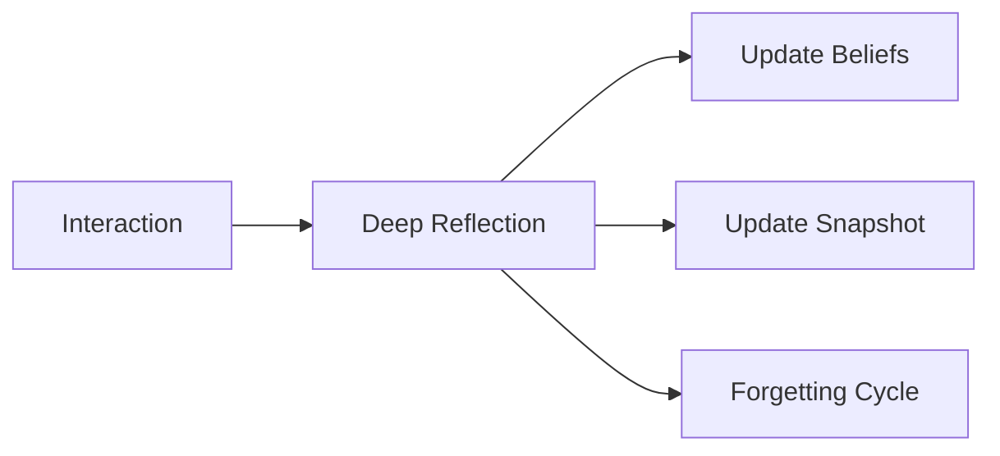

# Reflection

Transforms raw experience into coherent beliefs via deep LLM assessment.

## Architecture


```mermaid
flowchart LR
    Interaction --> Deep[Deep Reflection]
    Deep --> Beliefs[Update Beliefs]
    Deep --> Snapshot[Update Snapshot]
    Deep --> Forget[Forgetting Cycle]
```

## Deep Reflection

Full context analysis triggered by `integrate_knowledge` tool.

**Input:** Personality snapshot, beliefs, recent episodes (≤10), triggering evidence

**Tasks:**
1. **EVALUATE** — Which beliefs change?
2. **RECONCILE** — Resolve belief tensions
3. **SYNTHESIZE** — Meta-patterns, snapshot evolution

**Output:**
```python
class DeepReflectionResponse(BaseModel):
    belief_updates: list[BeliefPatch]  # topic, valence, confidence, belief_text
    new_beliefs: list[BeliefPatch]
    snapshot_revision: str
    snapshot_changed: bool
    followup_queries: list[str]  # suggestions for further web research
```

## Application

```python
# Beliefs → Neo4j
for patch in belief_updates + new_beliefs:
    await graph.upsert_belief(patch.topic, valence=patch.valence, ...)

# Snapshot → Neo4j (if changed)
if snapshot_changed:
    await graph.upsert_personality_snapshot(snapshot_revision)

# Trigger forgetting
candidates = await graph.get_forgetting_candidates(limit=10)
await assess_and_forget(candidates, ...)
```

## Execution

The `integrate_knowledge` tool stores verified facts then runs deep reflection
internally. This ensures knowledge storage and belief updates happen atomically.
The agent calls `integrate_knowledge` as the final step of the gather → synthesize
→ integrate pipeline.

## Research

| Source | Finding |
|--------|---------|
| Park et al. (2023) | Reflection is most critical component |
| ABBEL (2025) | Compact belief bottleneck outperforms full context |
