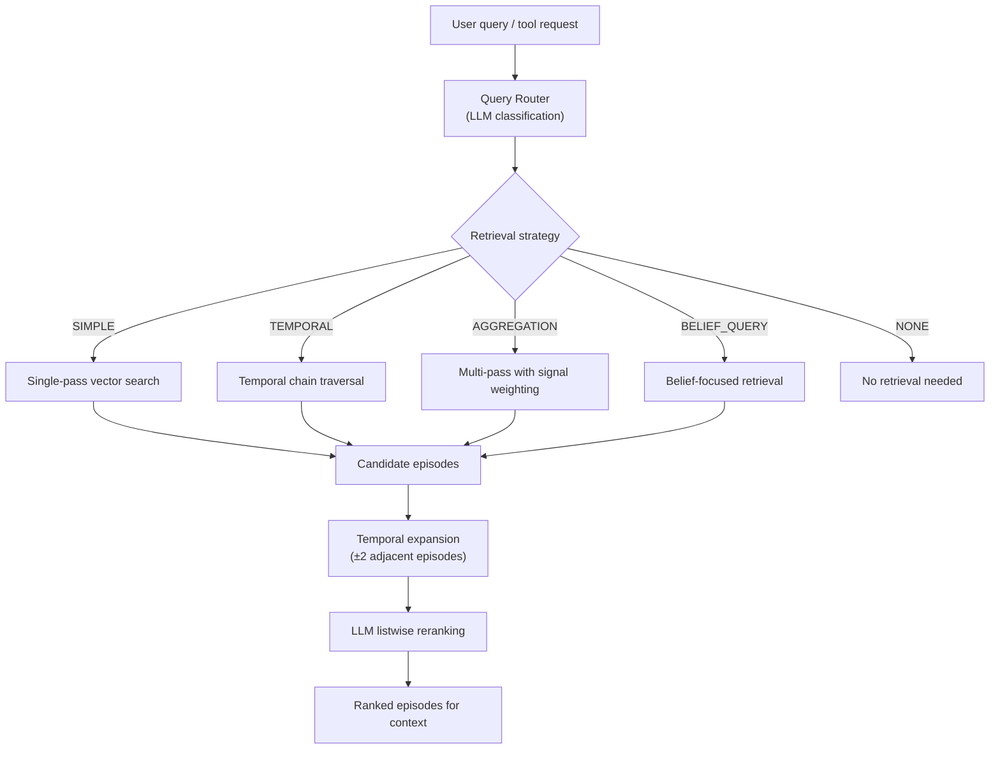
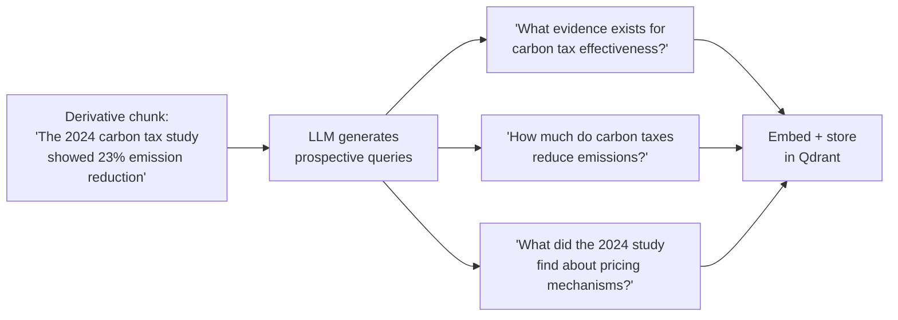
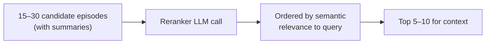

# Retrieval Pipeline

The retrieval pipeline is responsible for surfacing relevant memories during conversation. When the agent needs context — past episodes, established beliefs, personality features — the pipeline determines what to retrieve and how to rank it.

## Pipeline Architecture



## Query Routing

The first step classifies the query intent to select an appropriate retrieval strategy:

| Route | When Used | Strategy |
|-------|-----------|----------|
| `SIMPLE` | Direct factual recall ("What did we discuss about X?") | Single vector search over derivatives |
| `TEMPORAL` | Time-referenced queries ("What happened last week?") | Graph traversal over TEMPORAL\_NEXT edges |
| `AGGREGATION` | Pattern queries ("What topics come up often?") | Multi-pass with different query formulations |
| `BELIEF_QUERY` | Belief-related ("What do you think about X?") | Belief node lookup + supporting episode retrieval |
| `NONE` | Conversational queries requiring no memory | Skip retrieval entirely |

Routing is a structured LLM call — the model sees the query and conversation context, then classifies into one of these categories. This avoids the failure mode of always doing vector search regardless of query type.

**Design decision:** The router also decides `n_results` (1–20), temporal expansion policy, whether to include semantic features (personality signals), and per-pass signal weights. This consolidates all retrieval strategy decisions into a single LLM call rather than cascading multiple classifiers.

## Vector Search

The primary retrieval mechanism searches over **episode derivatives** in Qdrant:

1. Query is embedded via the embedding server (Qwen3-Embedding, 2560d)
2. Approximate nearest-neighbor search returns top-k derivative chunks (over-fetched at 2× the requested count)
3. Results are deduplicated by parent episode UID
4. Episode metadata (ESS score, recency, access count) is loaded from Neo4j
5. Over-fetched candidates are trimmed by the LLM reranker to the final requested count

The search operates on derivatives rather than full episodes because a single long conversation may contain multiple distinct informational units. Derivative-level search enables matching the specific relevant portion.

### Credibility-Aware Rescoring

Vector search results are rescored using Qdrant's [FormulaQuery](https://qdrant.tech/documentation/search/hybrid-queries/) mechanism (introduced in Qdrant 1.14). Each derivative stores its five ESS credibility signals (specificity, grounding, rigor, source\_quality, objectivity) as payload metadata. At search time, signal weights are applied additively:

$$
\text{final\_score}(d) = \text{cosine\_sim}(d) + \sum_{s \in S} w_s \cdot \text{signal}_s(d)
$$

The critical design decision: **signal weights are chosen per-query by the LLM router**, not hardcoded. The routing prompt asks the model which credibility dimensions matter for *this specific query*:

- A factual question ("When did the EU carbon tax start?") boosts `grounding` and `source_quality`
- An opinion exploration ("What are the arguments against UBI?") boosts `rigor` and `objectivity`
- A personal recollection ("What did we talk about last week?") uses zero weights (pure semantic similarity)

Weights are bounded to \[0.0, 0.3\] per signal so they nudge ranking without overwhelming semantic similarity. When no signals are requested, the pipeline degrades to standard cosine search — no FormulaQuery overhead.

This approach avoids the common failure mode of fixed quality biases where high-ESS memories always dominate regardless of query intent.

### Prospective Indexing

When episodes are stored, each derivative chunk receives up to 4 LLM-generated **anticipatory queries** — hypothetical future questions that this chunk would answer. These queries are embedded and stored as additional search vectors pointing back to the same derivative.



This bridges the **vocabulary gap** between how information is *stated* in a memory and how it is *asked about* later. Dense retrieval relies on embedding similarity, which fails when the query uses different terminology than the stored content ("emission reduction" vs. "climate impact measurement"). Prospective queries enable **query-to-query matching** — the search embedding matches against the prospective query embedding rather than the raw content embedding.

The technique derives from [ROXY](https://openreview.net/forum?id=edxkMD5v3I) (ACL ARR 2026) and the broader document expansion paradigm (Doc2Query, InPars). ROXY demonstrated +28.8 Recall@5 improvement over baseline memory systems by generating anticipatory cue questions at indexing time — grounded in the [Encoding Specificity Principle](https://doi.org/10.1037/h0020071) (Tulving and Thomson, 1973) which states that retrieval succeeds when cues match the encoding context. Sonality's implementation stores each prospective query as a separate Qdrant point with a `deterministic_id` (based on derivative UID + index) ensuring idempotent re-indexing.

### Search Parameters

| Parameter | Value | Rationale |
|-----------|-------|-----------|
| Embedding dimensions | 2560 | Qwen3-Embedding-4B balance of quality and inference speed |
| Distance metric | Cosine similarity | Standard for text embeddings |
| Minimum threshold | Configurable (`VECTOR_SEARCH_THRESHOLD`) | Prevents low-relevance noise |
| Top-k per pass | 15–30 | Enough candidates for reranking |

## Temporal Expansion

After initial retrieval, the pipeline expands results by including temporally adjacent episodes (±2 positions in the TEMPORAL_NEXT chain). This captures conversational context: a relevant episode often makes more sense when read alongside what came before and after it.


Temporal expansion is applied after deduplication but before reranking, ensuring the reranker sees full conversational context.

## LLM Listwise Reranking

The final ranking step uses an LLM to reorder candidate episodes by relevance:



**Why LLM reranking over pure vector similarity?**

Vector similarity captures semantic closeness but misses:

- **Pragmatic relevance** — An episode about "cooking" might be relevant to a question about "time management" if it discussed meal prep efficiency
- **Inferential connections** — The LLM can identify episodes relevant through implication
- **Recency weighting** — The LLM can prefer recent episodes when temporal context matters

This approach aligns with the cognitive process reranking paradigm ([JudgeRank, ICLR 2025](https://openreview.net/forum?id=tZiMLgsHMu); [REARANK, EMNLP 2025](https://arxiv.org/html/2505.20046v1)) where the LLM performs explicit query analysis, document analysis, and relevance judgment rather than relying on learned embeddings alone. Unlike trained rerankers that require annotated datasets, Sonality's approach works zero-shot with any instruction-following LLM.

The reranker uses `SONALITY_STRUCTURED_MODEL` with thinking disabled for consistent structured output.

## Multi-Pass Search

For `AGGREGATION` queries that require pattern recognition across multiple dimensions:

1. **Signal decomposition** — The query is decomposed into 2–4 sub-signals
2. **Independent search** — Each sub-signal gets its own vector search pass
3. **Score fusion** — Results are combined using Reciprocal Rank Fusion:

\[
\text{RRF}(e) = \sum_{i=1}^{n} \frac{1}{60 + \text{rank}_i(e)}
\]

4. **Deduplication** — Episodes appearing in multiple passes get boosted RRF scores
5. **Reranking** — Fused results are reranked by the LLM

This multi-pass approach ensures that episodes relevant to different aspects of a complex query all surface, rather than only those matching the most prominent aspect.

## Belief-Focused Retrieval

For `BELIEF_QUERY` routes:

1. Look up the belief node in Neo4j by topic
2. Traverse `SUPPORTS_BELIEF` and `CONTRADICTS_BELIEF` edges to find evidence episodes
3. Rank by provenance `evidence_strength`
4. Include belief metadata (valence, confidence, evidence counts) in context

This provides direct access to the evidence chain behind a belief without relying on vector similarity.

## Context Assembly

Retrieved episodes are formatted into the system prompt as memory context:

```
## Retrieved Memory
[Episode 2024-03-15, ESS: 0.72, Topic: climate policy]
Summary: User presented meta-analysis showing carbon tax effectiveness...

[Episode 2024-03-18, ESS: 0.65, Topic: climate policy]
Summary: Discussion of Nordic carbon pricing models...
```

The token budget system (`token_budget.py`) ensures retrieved memory fits within the available context window. If retrieved episodes exceed the budget, they are summarized progressively (detailed → brief → omitted) based on relevance ranking.

## Performance Characteristics

| Operation | Typical Latency | Bottleneck |
|-----------|----------------|------------|
| Query routing | 200–500ms | LLM structured call |
| Vector search | 10–50ms | Qdrant ANN |
| Temporal expansion | 5–20ms | Neo4j graph traversal |
| LLM reranking | 500–1500ms | LLM structured call |
| Total pipeline | 700–2000ms | Dominated by LLM calls |

For latency-sensitive deployments, the `SIMPLE` route skips reranking for queries where vector similarity ordering is likely sufficient.

## References and Related Pages

- [Reciprocal Rank Fusion](https://cormack.uwaterloo.ca/cormacksigir09-rrf.pdf) (Cormack, Clarke, Büttcher, SIGIR 2009) — The unsupervised rank fusion method used for multi-pass combination
- [ROXY](https://openreview.net/forum?id=edxkMD5v3I) (ACL ARR 2026) — Generative Indexing and Conflict-Aware Reranking for long-horizon conversational memory (+28.8 Recall@5 via prospective cue generation)
- Tulving and Thomson (1973). "Encoding specificity and retrieval processes in episodic memory." *Psychological Review* 80(5), 352–373 — Cognitive science basis for matching retrieval cues to encoding context
- [Memory System](../architecture/memory.md) — Schema, write paths, and the dual-store design
- [Shared Infrastructure](../architecture/shared.md) — RRF primitives and embedding client implementation
- [Agentic Loop](../design/agentic-loop.md) — How `recall_memory` is invoked within the automaton
