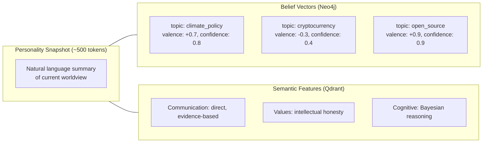
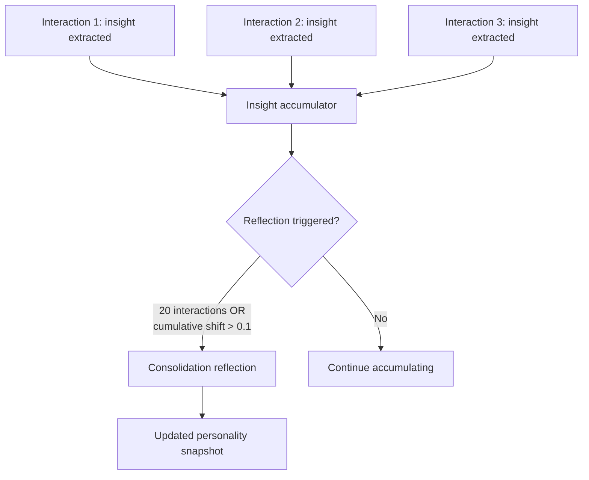

# Sponge Architecture

The Sponge is Sonality's mutable personality representation — a ~500-token natural-language narrative that summarizes the agent's current worldview, preferences, and characteristic behaviors. It "absorbs" conversations over time, but only when evidence quality passes the ESS gate.

## Design Decision: Natural Language Over Structured State

Early personality agent designs used structured representations: OCEAN scores, trait vectors, or key-value personality maps. Sonality uses natural language because:

1. **LLMs reason better over prose** than over numeric vectors. A narrative description of personality is directly usable in the system prompt without translation.
2. **Expressiveness** — Natural language captures nuance, conditionality, and context that flat scores cannot ("skeptical of blockchain claims except when backed by on-chain data")
3. **RAG efficiency** — Research shows prompt-based personality via RAG is ~14x more effective than PEFT for consistent personality expression (arXiv:2409.09510)
4. **Interpretability** — Operators can read the snapshot and immediately understand the agent's current state
5. **Empirically validated** — ABBEL (arXiv:2512.20111, 2025) independently confirmed that forcing an agent through a compressed belief state outperforms giving it full conversation history. The compact Sponge is not just viable — it produces better personality coherence than unbounded context.

The ~500-token budget balances expressiveness against context consumption. It provides enough space for 8–15 distinct personality facets while leaving room for conversation history and memory context.

## State Components

The personality state consists of three coordinated stores:

| Store | What It Captures | Update Frequency |
|-------|------------------|------------------|
| **Snapshot** | Consolidated narrative personality summary | On reflection (every ~20 interactions or cumulative shift > 0.1) |
| **Beliefs** | Per-topic opinion vectors with evidence counts | On every ESS-passing interaction |
| **Features** | Persistent personality traits across categories | On bookkeeping (when ESS passes) |

## Update Mechanism

### Insight Accumulation

Rather than rewriting the snapshot on every interaction, Sonality accumulates **one-sentence insights** per qualifying interaction. This avoids the "Broken Telephone" effect where iterative LLM rewrites converge to generic text:

Each insight is a precise observation: "Expressed strong skepticism toward homeopathy based on meta-analysis evidence" or "Demonstrated preference for functional programming paradigms when discussing code architecture."

### Reflection Consolidation

When reflection triggers, the system first **selects which beliefs are relevant** using RRF fusion of two signals:

1. **Embedding similarity** --- Cosine similarity between accumulated evidence and each belief's text
2. **Graph strength** --- Confidence weighted by logarithmic evidence count (Weber-Fechner law):

$$
\text{strength}(b) = \text{confidence}(b) \times \left(1 + \frac{\ln(1 + \text{evidence\_count}(b))}{\ln 21}\right)
$$

The Weber-Fechner scaling ensures that the psychological impact of new evidence decreases logarithmically — going from 1 to 2 pieces of evidence matters more than going from 10 to 11. This mirrors the established IR practice of logarithmic relevance weighting for query-independent evidence ([Craswell et al., SIGIR 2005](https://www.microsoft.com/en-us/research/wp-content/uploads/2016/02/craswell_sigir05.pdf)), where static document features like PageRank are transformed via `w * log(S)` because raw values would otherwise dominate ranking scores. The `ln(21)` normalizer bounds the multiplier to \[1, 2\] for evidence counts up to 20.

The LLM then receives:

- Current personality snapshot
- Accumulated insights since last reflection
- Selected belief vectors (top 15 by relevance)
- Recent episode summaries

It produces a structured `DeepReflectionResponse` containing belief patches (updates to existing beliefs, up to 20), new belief proposals (up to 10), and optionally a revised personality snapshot narrative.

The reflection prompt follows a strict priority ordering (PRESERVE-first):

1. **PRESERVE** --- Maintain existing traits unless directly contradicted by new evidence
2. **INTEGRATE** --- Incorporate accumulated insights from the buffer
3. **SYNTHESIZE** --- Identify higher-order patterns ("I notice I tend to value X")
4. **SPECIFICITY** --- Inject concrete detail if the narrative has become generic

This ordering prevents the common failure mode where LLM rewrites gradually erode personality toward bland, safe positions. The "specificity injection" step explicitly counteracts the tendency of iterative summarization to produce increasingly generic text.

**Snapshot integrity validation**: After any reflection rewrite, `validate_snapshot` rejects the new narrative if it falls below 30 characters or retains less than 60% of the previous snapshot's length. This hard constraint prevents catastrophic information loss during reflection — a guardrail inspired by Open Character Training (2025) research showing that personality changes must be robust against LLM rewrite degradation.

**Web enrichment**: During reflection, the system can launch a lightweight "glance-depth" web research session via Fathom (1 page) to fact-check or contextualize belief updates. This ensures that personality evolution is grounded in external reality, not just conversational echo.

### Two-Tier Reflection

To avoid unnecessary compute, reflection uses a two-tier approach:

1. **Fast triage** — A lightweight LLM call determines whether deep reflection is warranted
2. **Deep reflection** — Full reflection with belief decay, narrative update, and provenance review

The triage call considers: number of accumulated insights, magnitude of belief changes, presence of contradictions, time since last reflection.

## Sponge Freeze

When ESS classifies a message as manipulative (`social_pressure`, `emotional_appeal`, `debunked_claim`, `anecdotal`), the sponge enters a **freeze state**:

- Staged opinion updates are discarded (not committed)
- Insight extraction is skipped
- Reflection is not triggered
- Knowledge extraction still runs (to capture stated facts)

This ensures that manipulative rhetoric — regardless of how confident or well-articulated — cannot shift the agent's personality. The agent can still learn facts from the conversation ("the user claims X") without adopting them as beliefs.

## Belief Resistance

Established beliefs resist change proportionally to their evidence base:

\[
\text{effective\_magnitude} = \text{base\_magnitude} \times \frac{1}{\text{confidence} + 1}
\]

A belief with confidence 0.9 (backed by many supporting episodes) requires much stronger evidence to shift than a belief with confidence 0.2 (recently formed, little support). This implements rational epistemic behavior: extraordinary claims require extraordinary evidence.

## Bootstrap Dampening

The first 10 interactions apply a 0.5x multiplier to all update magnitudes. This prevents "first-impression dominance" from the Deffuant bounded confidence model — where early interactions disproportionately shape long-term personality because they face no resistance from established beliefs.

## Decay

Beliefs that are not reinforced by new evidence gradually decay toward neutral:

- Decay is assessed during reflection consolidation
- LLM evaluates each belief for recency of supporting evidence
- Beliefs with no recent support have confidence reduced
- Fully decayed beliefs (confidence → 0) are removed from active state

This implements FadeMem-inspired power-law decay: recent beliefs are strongly retained while old, unreinforced beliefs fade. The result is that personality reflects current evidence rather than historical artifacts.

## Immutable Core Identity

Beneath the mutable sponge sits an immutable **core identity** — a fixed system prompt component that defines:

- Fundamental character traits (cannot be changed by users)
- Communication style baselines
- Ethical boundaries
- Response format preferences

The core identity acts as an anchor against catastrophic drift. Even if the sponge narrative evolves significantly, the core identity ensures the agent maintains basic consistency. This is the "Soul Document" pattern from personality agent research.

## Comparison to Alternatives

| Approach | Sonality's Choice | Alternative | Rationale |
|----------|-------------------|-------------|-----------|
| Personality storage | Natural language narrative | OCEAN vectors / trait scores | Better LLM reasoning, more expressive |
| Update timing | Insight accumulation → batch reflection | Per-interaction full rewrite | Avoids Broken Telephone effect |
| Update gating | ESS + manipulative type filter | Always update / threshold only | Multi-layer defense against noise |
| Decay model | LLM-assessed during reflection | Fixed exponential / power-law | Context-aware; considers topic relevance |
| State persistence | Neo4j graph | JSON file / relational DB | Supports provenance edges and temporal queries |

## References and Related Pages

- [ABBEL](https://arxiv.org/abs/2512.20111) (2025) — The "belief bottleneck" validates the core Sponge hypothesis: forcing an agent through a compressed personality state *outperforms* giving it full conversation history
- [RAG vs fine-tuning for personality](https://arxiv.org/abs/2409.09510) (2024) — Shows RAG-based personality ~14x more effective than PEFT
- [FadeMem](https://arxiv.org/abs/2601.18642) (2025) — Biologically-inspired forgetting with adaptive decay functions
- Park et al. (2023). "[Generative Agents](https://arxiv.org/abs/2304.03442)" — Reflection ablation showing 8 SD improvement in agent believability; validates periodic consolidation
- [Evidence Strength Score](ess.md) — How argument quality gates sponge updates
- [Belief Revision](belief-revision.md) — How individual beliefs within the sponge are modified
- [Memory System](../architecture/memory.md) — Where personality state is persisted (Neo4j + Qdrant)
