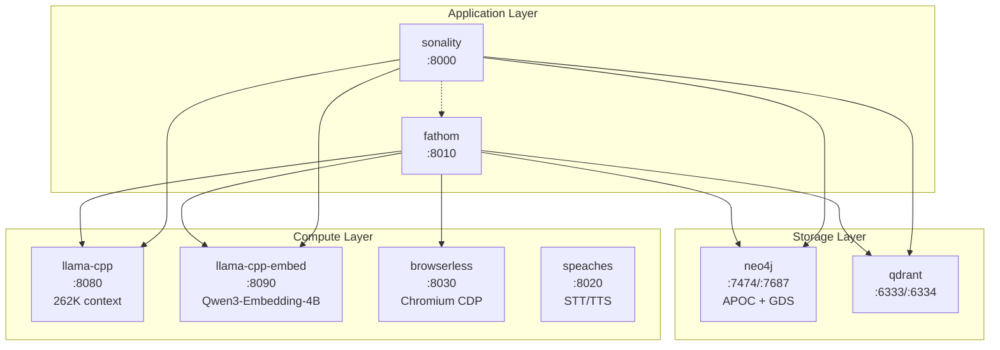

# Docker Stack

The Docker Compose configuration provides a complete local development environment with all services running in containers. A single `docker compose up` starts everything needed for full operation.

---

## Service Architecture



---

## Services

### Sonality (Application)

- **Image:** Custom build from `docker/sonality.Dockerfile`
- **Base:** `python:3.13-slim`
- **Port:** 8000
- **Dependencies:** Neo4j, Qdrant, LLM server, Embedding server
- **Health check:** `/health` endpoint

### Fathom (Research)

- **Image:** Custom build from `docker/fathom.Dockerfile`
- **Base:** `python:3.13-slim`
- **Port:** 8010
- **Dependencies:** Neo4j, Qdrant, LLM server, Embedding server, Browserless
- **Health check:** `/health` endpoint

### llama-cpp (LLM Inference)

- **Port:** 8080
- **Image:** `ghcr.io/ggml-org/llama.cpp:server-rocm` (ROCm) or `:server-cuda` (NVIDIA)
- **Context:** 262,144 tokens
- **Default model:** `Qwen3.6-35B-A3B-UD-Q4_K_XL` (Fathom), `gemma-4-E4B-it-Q8_0` (Sonality)
- **GPU:** Full offload (`-ngl all`) with flash attention and quantized KV cache (Q4_0 for both K and V)
- **Slots:** 1 (single concurrent request to maximize context utilization)

Key llama.cpp flags:

| Flag | Value | Purpose |
|------|-------|---------|
| `--ctx-size` | 262144 | Full 262K context window |
| `--flash-attn on` | --- | Memory-efficient attention |
| `--cache-type-k/v` | `q4_0` | Quantized KV cache reduces VRAM by ~4x |
| `--kv-unified` | --- | Single shared KV pool across slots |
| `--reasoning-format` | `deepseek` | Thinking token extraction for chain-of-thought models |
| `--jinja` | --- | Chat template rendering via Jinja2 |
| `--parallel` | 1 | Single request; all VRAM goes to context |

**GPU passthrough (ROCm/AMD):**

```yaml
devices:
  - /dev/kfd:/dev/kfd
  - /dev/dri:/dev/dri
environment:
  HSA_OVERRIDE_GFX_VERSION: "11.0.0"
  HIP_VISIBLE_DEVICES: "0"
```

For NVIDIA GPUs, replace the image tag with `:server-cuda` and use the standard `deploy.resources.reservations.devices` GPU reservation.

### llama-cpp-embed (Embeddings)

- **Port:** 8090
- **Model:** Qwen3-Embedding-4B (2560 dimensions)
- **Mode:** CPU inference (embedding models are lightweight)
- **Batch size:** Configurable for throughput tuning

### Neo4j (Graph Database)

- **Ports:** 7474 (HTTP), 7687 (Bolt)
- **Plugins:** APOC, Graph Data Science (GDS)
- **Memory:** Configurable heap and page cache
- **Volume:** `sonality_neo4j_data` for persistence

### Qdrant (Vector Database)

- **Ports:** 6333 (HTTP), 6334 (gRPC)
- **Storage:** File-based with memory-mapped segments
- **Volume:** `sonality_qdrant_data` for persistence

### Browserless (Web Fetching)

- **Port:** 8030
- **Protocol:** Chrome DevTools Protocol (CDP)
- **Connections:** Max 5 concurrent browser contexts
- **Used by:** Fathom only

### Speaches (STT/TTS)

- **Port:** 8020
- **Mode:** CPU inference
- **Used by:** Chat client (Telegram bot voice messages)
- **Optional:** Not required for text-only operation

---

## Common Operations

```bash
# Full stack
docker compose up -d           # Start everything
docker compose down            # Stop everything
docker compose logs -f sonality  # Follow Sonality logs

# Databases only (for local development with uv run)
make db-up                     # Start Neo4j + Qdrant
make db-down                   # Stop databases
make db-reset                  # Delete all data, restart fresh
make db-clear                  # Clear data, preserve schema

# Rebuild after code changes
docker compose build sonality fathom
docker compose up -d sonality fathom
```

---

## Volume Management

| Volume | Contents | Reset Command |
|--------|----------|---------------|
| `sonality_neo4j_data` | Graph data (episodes, beliefs, snapshots) | `docker volume rm sonality_neo4j_data` |
| `sonality_qdrant_data` | Vector data (derivatives, features, knowledge) | `docker volume rm sonality_qdrant_data` |
| `sonality_neo4j_logs` | Neo4j transaction logs | `docker volume rm sonality_neo4j_logs` |

To fully reset the agent's personality and memory:

```bash
make db-reset  # Deletes all volumes and restarts databases
```

---

## Resource Requirements

Minimum hardware for the full stack:

| Component | RAM | GPU VRAM | Disk |
|-----------|-----|----------|------|
| llama-cpp (LLM) | 2 GB | 8-24 GB | 4 GB (model) |
| llama-cpp-embed | 4 GB | --- | 2 GB (model) |
| Neo4j | 2 GB | --- | 1 GB+ |
| Qdrant | 1 GB | --- | 1 GB+ |
| Browserless | 1 GB | --- | 500 MB |
| Application services | 1 GB | --- | 200 MB |

For the LLM server, VRAM requirements depend on model size and quantization. A Q4_K_M quantized 8B model fits in 8GB VRAM; larger models or higher quantization levels require more.

---

## Partial Stack Operation

Not all services are required:

| Configuration | Required Services | Omitted | Capability Loss |
|--------------|-------------------|---------|----------------|
| Full | All | None | None |
| No research | Sonality + DBs + LLM + Embed | Fathom, Browserless | No web research |
| No voice | All except Speaches | Speaches | No voice in Telegram |
| Cloud LLM | Sonality + DBs | LLM servers | Uses cloud API instead |
| Minimal | Sonality + Neo4j + Qdrant | Everything else | Cloud LLM, no research, no embeddings |

Start specific services:

```bash
docker compose up -d neo4j qdrant sonality  # Minimal with cloud LLM
docker compose up -d neo4j qdrant llama-cpp llama-cpp-embed sonality  # Local LLM, no research
```
