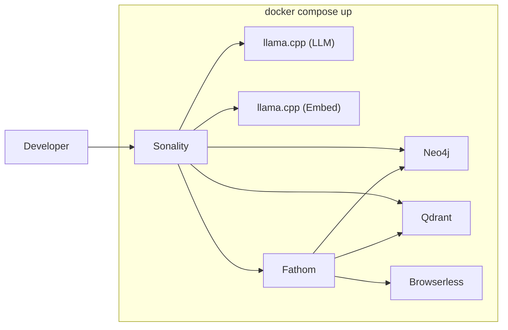

# Deployment

Sonality runs as a set of cooperating services: the personality engine, the research engine, databases, LLM inference, and optional client interfaces. This section covers how to configure and deploy the system.

## Deployment Models

### Local Development (Single Machine)



Everything runs from a single `docker compose up`. The compose file defines all services with appropriate resource limits, health checks, and dependency ordering.

### Hybrid (Local Services + Cloud LLM)

Run databases and infrastructure locally while using a cloud LLM provider:

```bash
cp .env.example .env
# Set SONALITY_BASE_URL to cloud endpoint (OpenAI, Anthropic, etc.)
# Set SONALITY_API_KEY
docker compose up -d neo4j qdrant  # databases only
make serve                          # Sonality with cloud LLM
```

### Production

For production deployments, each service can be scaled independently. The stateless-per-request design of both Sonality and Fathom means horizontal scaling requires no session affinity:

- **Sonality** — Stateless, horizontally scalable behind a load balancer. Each request loads identity fresh from Neo4j.
- **Fathom** — Stateless, scalable per research volume. Sessions are persisted in Neo4j, not in-process.
- **Neo4j** — Single instance or cluster (personality state is append-mostly, rarely conflicts)
- **Qdrant** — Cluster mode for high-volume vector search
- **LLM** — One or more inference servers with model-appropriate hardware

## Service Inventory

| Service | Default Port | Health Check | Resource Notes |
|---------|-------------|--------------|----------------|
| Sonality | 8000 | `GET /health` | CPU-bound (LLM calls are remote) |
| Fathom | 8010 | `GET /health` | CPU-bound + network I/O |
| Neo4j | 7474 (HTTP), 7687 (Bolt) | Built-in | 1–2GB RAM typical |
| Qdrant | 6333 (HTTP), 6334 (gRPC) | Built-in | RAM proportional to collection size |
| llama-cpp (LLM) | 8080 | `GET /health` | GPU-bound (ROCm/CUDA) |
| llama-cpp (Embed) | 8090 | `GET /health` | CPU-viable (4B model) |
| Browserless | 8030 | Built-in | ~512MB RAM per browser session |
| Speaches | 8020 | Built-in | CPU for Whisper/Kokoro |

## Quick Start Commands

```bash
# Full local stack (requires GPU for LLM)
cp .env.example .env
docker compose up -d

# Databases only (use cloud/external LLM)
docker compose up -d neo4j qdrant

# Run Sonality standalone
make serve

# Run interactive REPL
make run

# Terminal chat client
make chat

# Telegram bot
make telegram
```

## Pages

- [Configuration Reference](configuration.md) — All environment variables and their effects
- [Docker Setup](docker.md) — Container configuration, resource allocation, GPU setup
