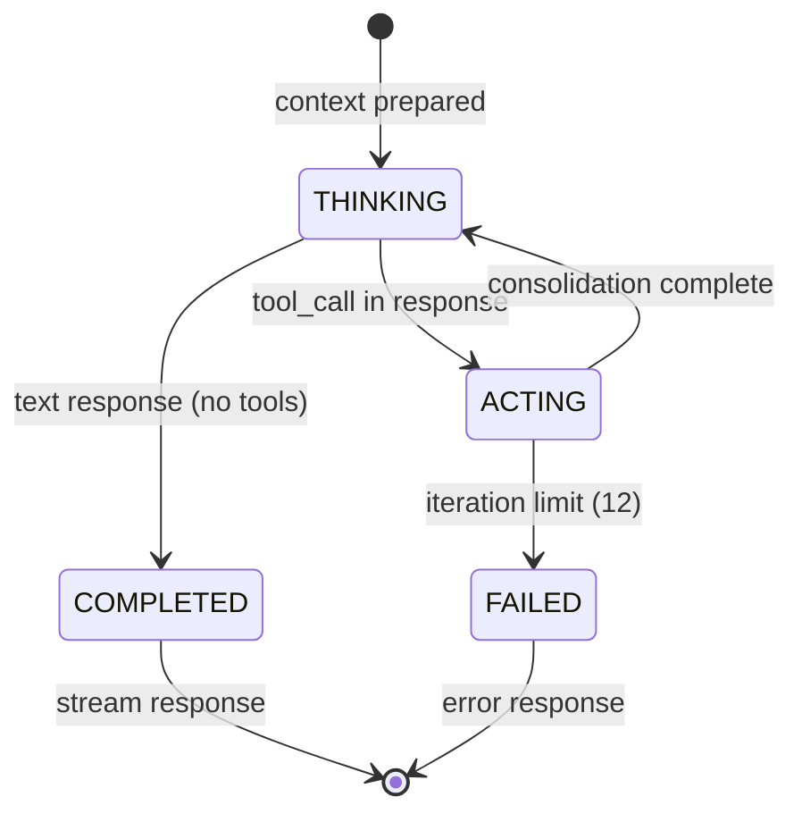
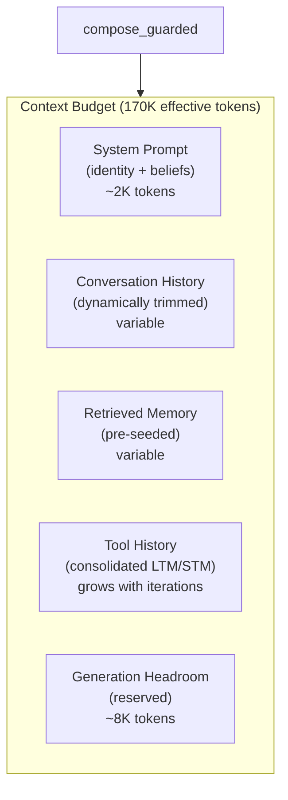
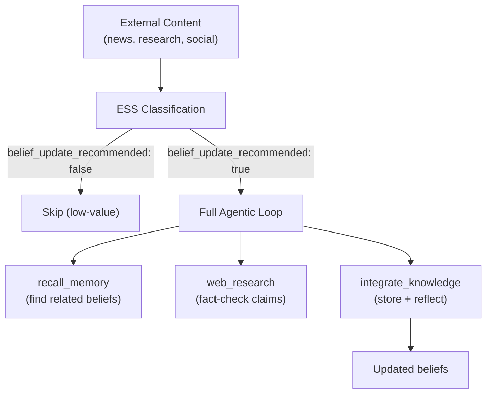

# Agentic Loop

The agentic loop is Sonality's core execution model. Rather than following a fixed pipeline of steps, the agent operates as a state machine that autonomously decides what actions to take based on the current context. This design enables flexible behavior --- from simple conversational responses (no tools, single LLM call) to complex multi-step research flows (multiple tool calls across several iterations).

---

## State Machine Design

The loop implements a 2-phase automaton derived from the [ReAct paradigm](https://arxiv.org/abs/2210.03629) (Yao et al., ICLR 2023): interleaved reasoning and acting. Sonality's variant enforces strict single-action-per-step execution with mandatory consolidation between iterations — adapting ReAct for bounded-context operation on quantized models:

**Why a state machine over a fixed pipeline:**

A fixed pipeline (retrieve → reason → respond) forces the same execution path for every query. The agentic loop allows the agent to:
- Skip retrieval entirely for simple greetings
- Perform multiple research passes for complex topics
- Integrate knowledge mid-conversation when new understanding emerges
- Terminate early when sufficient information is gathered

This flexibility comes from trusting the LLM's judgment about what action is needed next, guided by the available tool descriptions and current context.

---

## Phase Details

### THINKING Phase

The LLM receives:
- System prompt (core identity + personality snapshot + beliefs)
- Conversation history (trimmed to budget)
- Retrieved memory context (pre-seeded before loop start)
- Tool call history from previous iterations (consolidated)
- Available tool definitions

It produces either:
- A **tool call** --- transitioning to ACTING phase
- A **text response** --- transitioning to COMPLETED

The context is managed by `compose_guarded`, which ensures total token count stays within the effective budget (65% of context window).

### ACTING Phase

1. **Tool dispatch** --- The requested tool is executed asynchronously
2. **Result capture** --- Tool output is received (potentially very large for research results)
3. **Mandatory consolidation** --- A separate LLM call distills the tool result into:
   - **LTM entry** --- Concise factual summary for long-term memory
   - **STM entry** --- Key points relevant to the immediate conversation
4. **State update** --- LTM/STM entries replace the raw tool output in loop state

The mandatory consolidation step is the key innovation. Without it, raw tool results (which can be thousands of tokens from web research or dozens of retrieved episodes) would accumulate in the context window, rapidly exhausting the budget. Consolidation compresses each tool interaction into a few hundred tokens while preserving the essential information. This approach aligns with the emerging "context as a tool" paradigm: [CaT](https://arxiv.org/abs/2512.22087) (2025) separates context into fixed anchors, long-term memory summaries, and recent working memory; [HiAgent](https://aclanthology.org/2025.acl-long.1575/) (ACL 2025) uses subgoal-based summarization to achieve 2x success rate improvement on long-horizon tasks. Sonality's variant is architecture-mandated rather than agent-discretionary — consolidation happens unconditionally after every tool call.

### Emergent Termination

A notable design decision: the loop has **no explicit "DONE" signal**. The `MemoryUpdate` schema produced by consolidation contains only `long_term_memory` and `short_term_memory` fields — no "should_finish" boolean or "next_action" enum.

Instead, termination emerges naturally: when the STM entry contains content like "I have enough information to answer the user's question", the next THINKING phase produces a text response rather than another tool call, transitioning to COMPLETED. This avoids the brittleness of explicit decision fields where models might incorrectly signal completion prematurely.

If the agent stalls (repeats the same tool call, or iterates without progress), a stall counter triggers a "nudge" — a forced synthesis prompt that instructs the model to answer with whatever information it has gathered. This safety net ensures convergence even when the emergent termination signal doesn't fire naturally.

**Tool-call deduplication**: Each iteration's tool call is fingerprinted as `(tool_name, json.dumps(args, sort_keys=True))`. If a fingerprint repeats within the same request, it increments the stall counter immediately rather than executing the redundant call. This catches the common failure mode where LLMs enter loops requesting the same search query repeatedly.

### COMPLETED Phase

The final text response is extracted and streamed to the client via SSE. Progress events throughout the loop are also streamed, allowing clients to display real-time status (thinking, researching, recalling, etc.).

### FAILED Phase

Reached when the iteration limit (12) is hit or an unrecoverable error occurs. In practice, most interactions complete in 1-3 iterations. The limit exists as a safety valve for pathological cases.

---

## Context Budget Management

The loop maintains context through careful budget allocation:

If the total exceeds the budget:
1. Conversation history is trimmed (oldest messages first, with summarization)
2. Retrieved memory is reduced (lowest-ranked episodes removed)
3. Tool history is compressed further

**Anchored iterative summarization**: When conversation history exceeds 20 messages, the system generates a structured LLM summary (capturing intent, key facts, decisions, and open threads) from older turns. On subsequent overflows, the existing summary is *merged* with new older turns rather than regenerated from scratch ([arXiv:2603.29193](https://arxiv.org/abs/2603.29193)). This prevents information loss across long conversations — the summary accumulates facts incrementally, like a growing notebook, rather than re-summarizing from an ever-larger window.

This dynamic allocation ensures the agent never exceeds context limits regardless of conversation length or research complexity.

### Per-Iteration Working Memory

Each THINKING phase receives a structured context block that gives the LLM situational awareness:

| Section | Content | Purpose |
|---------|---------|---------|
| Iteration header | Current iteration / maximum remaining | Encourages convergence |
| Your Plan | Short-term memory from last consolidation | Maintains continuity |
| Research Findings | Long-term memory accumulated so far | Persistent factual context |
| Your Beliefs | Relevant belief vectors ranked by embedding similarity to current context | Opinion awareness |
| Actions Taken | Last 8 tool calls (compact one-line summaries) | Prevents repetition |
| Discipline Reminder | "Pick ONE next action" | Constrains the LLM to single-step reasoning |

This structure serves as a virtual "scratchpad" that persists across iterations without consuming proportional context. The compact format (tool calls are summarized to one line each) enables deep multi-step reasoning within tight context budgets.

---

## Comparison to Other Agentic Architectures

| Architecture | Loop Type | Consolidation | Context Strategy |
|-------------|-----------|---------------|-----------------|
| ReAct (Yao et al., 2023) | Thought-Action-Observation | None --- raw observations accumulate | Truncation |
| AutoGPT | Goal-plan-execute | Explicit memory writes | External memory |
| LATS (Zhou et al., 2023) | Tree search with backtracking | None | Full tree in context |
| **Sonality Automaton** | 2-phase with mandatory consolidation | Every tool result consolidated | Proportional compression |

Sonality's approach differs in that tool results are never raw-injected into subsequent thinking phases. This prevents the "context explosion" problem where a single research tool call consumes the entire remaining budget.

---

## Iteration Patterns

Observed patterns in production use:

| Pattern | Iterations | Description |
|---------|-----------|-------------|
| Direct response | 1 | Simple conversation, no tools needed |
| Recall + respond | 2 | Memory retrieval followed by informed response |
| Research flow | 3-4 | Web research + integration + response |
| Deep investigation | 5-7 | Multiple recall/research cycles with integration |
| Complex synthesis | 8-12 | Multi-topic research with belief reconciliation |

The agent naturally gravitates toward efficiency --- most interactions complete in 1-2 iterations. Extended flows occur only when the topic genuinely requires multiple information sources or when the agent identifies gaps in its knowledge that require research.

---

## Ingest Mode

The same agentic loop powers content ingestion (`POST /ingest`), enabling **autonomous belief formation** from external sources without human conversation:

The pipeline:

1. **Fire-and-forget submission** — `POST /ingest` returns HTTP 202 immediately with a job ID; status is pollable via `GET /ingest/{job_id}`
2. **Serialized processing** — An `asyncio.Queue` (maxsize 256) serializes jobs; the same agent lock prevents concurrent mutation with chat requests
3. **ESS triage** — Content below the belief-update threshold is skipped with zero further processing
4. **Agentic processing** — High-value content receives a specialized system prompt (current snapshot + beliefs) and runs the full tool suite. The model can fact-check claims via web research, recall existing memories for context, and integrate verified knowledge into its belief system
5. **Synchronous bookkeeping** — Unlike chat (where bookkeeping is async), ingest runs bookkeeping synchronously to ensure completeness before the next job

This is how the agent forms opinions about current events without manual interaction. The `make feed` command submits news articles from RSS feeds; each article passes through the same ESS gate and agentic loop as interactive conversation.

---

## Design Rationale

The 2-phase automaton was chosen over alternatives after evaluating several architectures:

**Rejected: Fixed pipeline** --- Too rigid; wastes compute on unnecessary steps and cannot handle variable-complexity queries.

**Rejected: Free-form agent (AutoGPT-style)** --- Too unconstrained; leads to goal drift, infinite loops, and context explosion without mandatory consolidation.

**Rejected: Tree search (LATS-style)** --- Too expensive; backtracking requires maintaining multiple context branches, impractical with 262K contexts.

**Chosen: 2-phase with consolidation** --- Provides autonomy (agent decides actions) with guardrails (mandatory consolidation prevents context explosion, iteration limit prevents infinite loops, state machine ensures well-defined transitions).

---

## References

- [Yao et al. (2023)](https://arxiv.org/abs/2210.03629). "ReAct: Synergizing Reasoning and Acting in Language Models." *ICLR 2023*.
- [Zhou et al. (2023)](https://arxiv.org/abs/2310.04406). "Language Agent Tree Search Unifies Reasoning, Acting, and Planning."
- Structured Agent Distillation (SRDP) --- Distilling complex agent behaviors into simpler state machines.
- PRIME framework --- Principled reasoning in multi-step environments.

See also: [Sonality Engine](../architecture/sonality.md) for the agent orchestrator, [Retrieval Pipeline](../concepts/retrieval.md) for how `recall_memory` works, [Configuration](../deployment/configuration.md) for token budget and loop ceiling settings.
