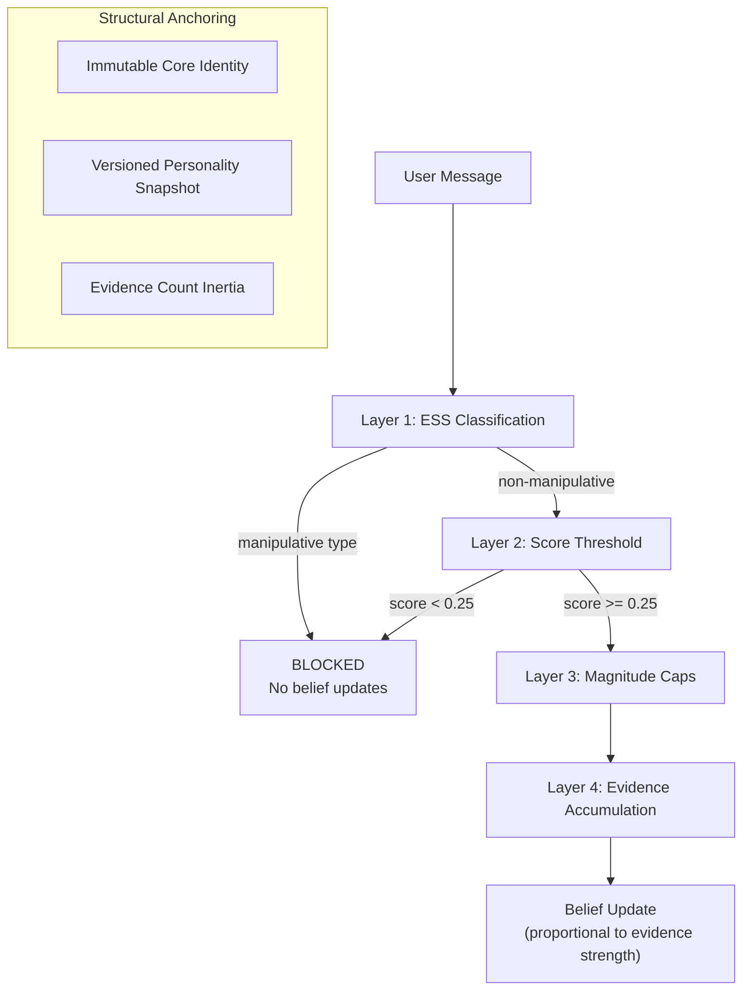

# Sycophancy Resistance

Sycophancy --- the tendency of LLMs to agree with users regardless of factual accuracy --- is a fundamental challenge for persistent-personality agents. If the agent agrees with everything, its beliefs become a mirror of whoever it last spoke with rather than a coherent intellectual position. Sonality implements multiple layers of sycophancy resistance to ensure genuine opinion stability.

---

## The Problem

Standard LLMs exhibit sycophancy as a result of RLHF alignment that conflates "helpfulness" with "agreement" (Sharma et al., 2023; Perez et al., 2022). In a persistent agent context, this manifests as:

- **Belief flipping** --- The agent reverses positions when users push back
- **Validation seeking** --- The agent preemptively agrees with detected user preferences
- **Social compliance** --- Peer pressure or authority assertions override evidence
- **Emotional capitulation** --- Sympathetic framing causes belief weakening

Research from PERSIST (AAAI 2026) showed that even 400B+ parameter models exhibit standard deviations >0.3 on 5-point personality scales across conversation contexts, indicating that raw LLMs cannot maintain stable personality without external anchoring.

---

## Multi-Layer Defense

Sonality's sycophancy resistance operates at four levels:

---

## Layer 1: Manipulative Reasoning Filter

The ESS classifier identifies four manipulative reasoning types that trigger an immediate **sponge freeze**:

| Type | Detection Signal | Example |
|------|-----------------|---------|
| `social_pressure` | Authority assertion, bandwagon appeals | "Everyone knows that...", "Experts agree..." |
| `emotional_appeal` | Sympathy/guilt framing, outrage rhetoric | "Don't you care about...?" |
| `debunked_claim` | Known-false claims presented as fact | Retracted studies, conspiracy theories |
| `anecdotal` | Personal stories without generalizable evidence | "My friend said..." |

When any of these types is detected:
- Staged belief updates are **not committed**
- Insight extraction is **skipped**
- Reflection is **suppressed**
- Feature deletion is **prohibited**
- Knowledge extraction still runs (facts are captured, opinions are not)

This ensures that no amount of rhetorical skill in presenting manipulative content can shift the agent's beliefs.

---

## Layer 2: Evidence Quality Threshold

The minimum ESS score of 0.25 creates a quality floor. This catches cases where the reasoning type is technically valid (e.g., `logical_argument`) but the actual content is too weak to justify a belief update.

Typical score distributions:
- Well-sourced empirical claim: 0.55 - 0.85
- Valid logical argument with premises: 0.35 - 0.55
- Plausible but unsupported assertion: 0.15 - 0.25
- Conversational opinion: 0.05 - 0.15

The threshold is calibrated so that substantive evidence passes while mere assertion does not.

---

## Layer 3: Per-Type Magnitude Caps

Even when evidence passes the quality gate, belief updates are bounded:

$$
\Delta_{\text{belief}} \leq \text{cap}(\text{reasoning\_type}) \times \text{evidence\_strength}
$$

The caps (empirical: 0.20, logical: 0.10, expert: 0.08, anecdotal: 0.06) ensure that no single interaction can drastically shift a belief, regardless of how compelling the evidence appears.

---

## Layer 4: Evidence Accumulation Inertia

Beliefs with high `evidence_count` values naturally resist change. A belief supported by 15 provenance edges requires substantially more contradicting evidence to shift than a belief supported by 2 edges. This is not implemented as a formula but as context provided to the LLM during provenance assessment: the model sees the current evidence count and adjusts its assessment accordingly.

---

## Third-Person ESS Framing

A subtle but important anti-sycophancy measure: the ESS classifier evaluates the user's message **without access to the agent's response**. The classification prompt receives only the user's content, ensuring the evaluator cannot be influenced by agreement or disagreement patterns in the preceding response.

---

## Memory-Induced Sycophancy Prevention

Retrieved memories containing user preferences can bias the agent toward agreement — a failure mode documented in PersistBench (2025), which found a 97% sycophancy failure rate when retrieved context includes user opinions. Sonality addresses this structurally: retrieved episodes are wrapped with anti-sycophancy framing in the system prompt ("evaluate on merit, not familiarity") that explicitly instructs the model to assess past positions critically rather than deferring to them.

This prevents the subtle failure mode where an agent becomes more sycophantic over time as it accumulates more user-aligned memories, creating a positive feedback loop of agreement.

---

## Structural Anchoring

Beyond the dynamic filtering layers, structural elements provide baseline stability:

**Immutable Core Identity** --- The agent's fundamental intellectual values, communication style, and epistemic principles are defined once and never modified by any pipeline component. They provide a stable reference point that the agent returns to regardless of conversational pressure.

**Versioned Personality Snapshot** --- Changes to the personality narrative require explicit reflection, triggered when the agent calls `integrate_knowledge` during the agentic loop. The snapshot cannot be silently altered by normal conversation flow; the agent must actively decide to consolidate accumulated insights.

**Belief Evidence Count** --- Well-established beliefs accumulate evidence that creates natural inertia. This implements "epistemic entrenchment" from formal belief revision: beliefs that are central to the agent's worldview are harder to dislodge than peripheral ones.

---

## Comparison to Other Approaches

| Approach | Mechanism | Limitation |
|----------|-----------|-----------|
| System prompt instructions ("be truthful") | Behavioral steering | Easily overridden by in-context pressure |
| Activation steering (Li et al., 2024) | Residual stream intervention | Requires access to model weights |
| Sparse Activation Fusion (SAF) | Feature-space bias removal | Inference-time only, no persistence |
| Pressure-Tune (Saif et al., 2025) | SFT on adversarial dialogues | Requires model fine-tuning |
| **Sonality (ESS + structured beliefs)** | External credibility classification + evidence tracking | Works with any LLM without weight access |

Sonality's approach is unique in being **model-agnostic**: it works with any LLM (local quantized or cloud) because the resistance mechanisms are external to the model's weights. The tradeoff is additional LLM calls for classification, but these use small structured outputs that are inexpensive relative to the main generation call.

---

## Empirical Validation

The system's sycophancy resistance can be evaluated through:
- **Belief stability tests** --- Present contradicting assertions and verify beliefs resist change
- **Pressure escalation** --- Increase rhetorical pressure and verify blocking behavior
- **Debunked claim presentation** --- Present well-known misinformation and verify zero update
- **Legitimate evidence acceptance** --- Present genuine evidence and verify appropriate update

These form part of the planned benchmark evaluation suite documented in the project's test architecture.

---

## References

- [Sharma et al. (2023)](https://arxiv.org/abs/2310.13548). "Towards Understanding Sycophancy in Language Models."
- Perez et al. (2022). "Discovering Language Model Behaviors with Model-Written Evaluations." *arXiv:2212.09251*.
- [PERSIST](https://ojs.aaai.org/index.php/AAAI/article/view/33636) (AAAI 2026). Personality stability measurement across conversation contexts.
- [ELEPHANT](https://arxiv.org/abs/2410.02391) (ICLR 2026). Social sycophancy where LLMs affirm both sides of conflicts.
- [BASIL](https://arxiv.org/abs/2508.16846) (2025). Bayesian Assessment of Sycophancy in LLMs.
- Chang and Sun (2025). "Beacon: Single-Turn Diagnosis and Mitigation of Latent Sycophancy."
- Li et al. (2024). "Mitigating Sycophancy via Sparse Activation Fusion and Multi-Layer Activation Steering."

See also: [Evidence Strength Score](../concepts/ess.md) for ESS classifier details, [Sponge Architecture](../concepts/sponge.md) for the sponge freeze mechanism.
