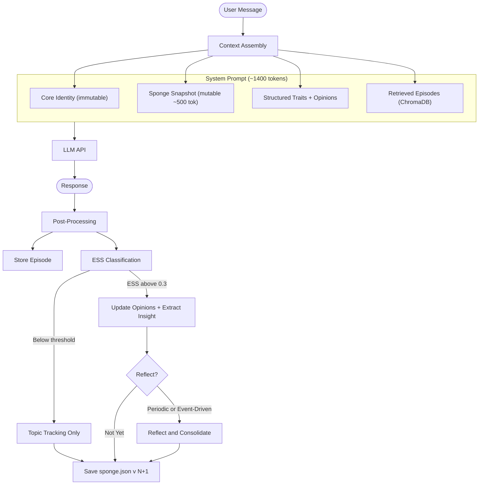

# Sonality

**An LLM agent with a self-evolving personality, grounded in 200+ academic references.**

Sonality uses the **Sponge architecture** — a compact natural-language personality narrative (~500 tokens) that absorbs every conversation, modulated by an Evidence Strength Score (ESS) that differentiates rigorous arguments from casual noise.

The result: an AI agent with genuine opinions that change over time. Strong arguments shift its views. Random chat barely moves the needle. Like a reasonable person encountering new information.

---

## Why Sonality Exists

Most LLM agents have no personality. They are agreeable, generic, and stateless — every conversation starts from the same blank slate. Some systems attempt personality through static system prompts, but research shows this fails within 8 conversation rounds[^1].

Sonality takes a different approach: **personality as external, evolving state**. Rather than relying on the model's weights or static prompts, Sonality maintains a structured personality state on disk that grows and changes through interaction. Every conversation contributes to who the agent becomes — but not all conversations contribute equally.

[^1]: Persona drift measured within 8 rounds — arXiv:2402.10962.

## Key Principles

**Evidence-gated evolution.** Not every message changes the personality. The Evidence Strength Score classifies each interaction for argument quality (0.0–1.0). Only messages with genuine reasoning, evidence, or novel perspectives above the threshold trigger personality updates. Casual chat, social pressure, and bare assertions are filtered out.

**Bayesian belief resistance.** Established beliefs resist change proportionally to their evidence base. A belief formed from 10 strong conversations is harder to shift than one formed from a single exchange. This prevents a single persuasive user from overwriting the agent's entire worldview.

**Periodic reflection.** Raw interaction data accumulates as insights. Periodically, the agent reflects — consolidating accumulated insights into its personality narrative, decaying unreinforced beliefs, and synthesizing higher-order patterns. This mirrors human memory consolidation during sleep[^2].

[^2]: Park et al. (2023) — ablation showed reflection is the most critical component for believable agents.

**Anti-sycophancy by design.** LLMs are architecturally predisposed to agree with users (58% sycophancy rate baseline). Sonality counteracts this through seven defensive layers: immutable core identity, ESS decoupled from the agent's own response, third-person evaluation framing, Bayesian belief resistance, bootstrap dampening, anti-sycophancy memory framing, and structural disagreement detection.

## Architecture at a Glance

## What Makes This Novel

After reviewing 200+ papers and frameworks, several aspects of Sonality's design have no direct precedent:

1. **ESS decoupling** — evaluating the *user's argument quality* independently from the agent's response, avoiding the self-judge bias documented up to 50 percentage points (SYConBench, EMNLP 2025).

2. **Insight accumulation over lossy rewrites** — per-interaction insights are accumulated and consolidated only during reflection, avoiding the "Broken Telephone" effect where iterative LLM rewrites converge to generic text (ACL 2025).

3. **Bayesian belief resistance with power-law decay** — combining logarithmic confidence growth (more evidence = more resistance to change) with Ebbinghaus-inspired forgetting (unreinforced beliefs gradually fade). No other system integrates both mechanisms.

4. **Bootstrap dampening** — early interactions (first 10) receive 0.5× magnitude scaling, preventing "first-impression dominance" documented in bounded confidence models (Deffuant model).

---

## Quick Navigation

| Section | What You'll Learn |
|---|---|
| [Getting Started](getting-started.md) | Installation, configuration, first run |
| [Usage and Teaching Plan](usage-and-teaching-plan.md) | Step-by-step operational plan to use, shape, and monitor the agent |
| [Architecture](architecture/overview.md) | System design, memory model, data flow |
| [Research Upgrade Plan](architecture/research-upgrade-plan.md) | Prioritized architecture decisions mapped to latest findings |
| [Core Concepts](concepts/ess.md) | ESS, opinion dynamics, reflection, anti-sycophancy |
| [Architecture Assessment](architecture-assessment.md) | Research-driven evaluation of all 7 architectural areas |
| [Design Decisions](design-decisions.md) | What we chose, what we rejected, and why |
| [Research Background](research/background.md) | The academic foundations: 200+ papers synthesized |
| [Web Research Synthesis 2026](research/web-research-synthesis-2026.md) | Extended research notes mapped to architecture choices |
| [Personality Development](personality-development.md) | How the agent's character forms over time |
| [Training Guide](training-guide.md) | How to use, train, and monitor the agent (comprehensive) |
| [Testing & Evaluation](testing.md) | Testing pyramid, behavioral tests, adversarial testing |
| [Model Considerations](model-considerations.md) | Model selection guidance for each pipeline role |
| [Configuration](configuration.md) | All tuneable parameters and their rationale |
| [API Reference](api-reference.md) | Module-level documentation |
