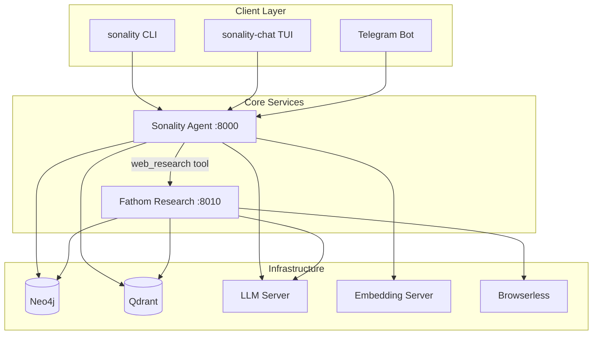

# Sonality

Sonality is an LLM agent system that maintains a persistent, self-evolving personality through evidence-gated belief revision. It combines a natural-language identity narrative with structured belief vectors, dual-store memory (graph + vector), and autonomous web research to produce coherent intellectual evolution rather than random drift.

The system addresses a fundamental challenge in persistent LLM agents: how to allow genuine opinion change in response to strong evidence while resisting manipulation, social pressure, and low-quality inputs. The solution draws on formal belief revision theory (AGM framework), sycophancy resistance research, and modern memory architectures.

---

## Core Capabilities

**Persistent Worldview** --- Beliefs are stored as structured vectors with valence, confidence, and evidence provenance. Updates occur only when the Evidence Strength Score classifier determines that incoming information meets quality thresholds.

**Sycophancy Resistance** --- A multi-layered filtering system prevents the agent from agreeing with users merely to be agreeable. Manipulative reasoning types (social pressure, emotional appeals, debunked claims) are blocked from modifying beliefs entirely.

**Autonomous Research** --- The Fathom subsystem performs live web research with zero-heuristic design. Every judgment in the research pipeline is an LLM call, from URL selection to fact extraction.

**Dual-Store Memory** --- Episodes are stored in both Neo4j (graph relationships, temporal ordering, belief provenance) and Qdrant (dense vector retrieval). This enables both structured graph traversal and semantic similarity search.

**Autonomous Belief Formation** --- The `/ingest` API enables feeding external content (news articles, research papers, social media) for autonomous processing. Content passes through the same ESS gate and agentic loop as interactive conversation, allowing the agent to form opinions about current events without manual interaction.

---

## System Composition

Sonality is a monorepo containing four Python packages that compose into a complete agent system:

```mermaid
flowchart TB
    subgraph clients ["Client Layer"]
        CLI["sonality CLI"]
        TUI["sonality-chat TUI"]
        TG["Telegram Bot"]
    end

    subgraph core ["Core Services"]
        SON["Sonality Agent :8000"]
        FAT["Fathom Research :8010"]
    end

    subgraph infra ["Infrastructure"]
        NEO[("Neo4j")]
        QD[("Qdrant")]
        LLM["LLM Server"]
        EMB["Embedding Server"]
        BR["Browserless"]
    end

    CLI --> SON
    TUI --> SON
    TG --> SON
    SON -->|"web_research tool"| FAT
    SON --> NEO
    SON --> QD
    SON --> LLM
    SON --> EMB
    FAT --> BR
    FAT --> LLM
    FAT --> NEO
    FAT --> QD
```

| Package | Role |
|---------|------|
| `sonality` | Personality engine --- agentic loop, belief revision, memory management |
| `fathom` | Web research engine --- search, fetch, analyze, fact extraction |
| `shared` | Cross-service infrastructure --- LLM provider, embeddings, database utilities |
| `chat` | Client implementations --- terminal TUI, Telegram bot, audio processing |

---

## Design Principles

The project follows several non-negotiable principles that shape every implementation decision:

- **LLM-first over heuristics** --- Routing, classification, forgetting, chunking, and reranking are all LLM-driven with structured output parsing. No hand-crafted rules substitute for model judgment.
- **Evidence gating over permissive updates** --- Every belief modification passes through the ESS classifier. The system errs on the side of stability.
- **Simplicity over abstraction** --- Flat module structure, plain functions, minimal indirection. Complex domain logic still results in readable code.
- **Single configuration** --- One Docker Compose file, one `.env`, one `docker compose up` for the full development stack.
- **Research-backed decisions** --- Implementation choices cite academic papers and production systems. The architecture draws on 200+ references.

---

## Technical Foundation

| Layer | Technology |
|-------|------------|
| Language | Python 3.12+ |
| Package Manager | uv + hatchling |
| Web Framework | FastAPI + uvicorn |
| Graph Database | Neo4j 5 (APOC, GDS plugins) |
| Vector Database | Qdrant |
| LLM Interface | OpenAI-compatible HTTP (local or cloud) |
| Embeddings | llama.cpp embedding server (Qwen3-Embedding-4B, 2560d, MRL support) |
| Web Scraping | Playwright via Browserless CDP |
| Content Extraction | trafilatura + selectolax |
| Configuration | pydantic-settings + single .env |

---

## Vision and Problem Space

Sonality exists to solve a specific problem in LLM deployment: **how to give an agent a stable, evolving intellectual identity without fine-tuning.** 

Current approaches fail in characteristic ways:

- **Static system prompts** produce consistent but unchanging agents that cannot learn from users
- **Naive memory concatenation** produces drifting agents that absorb noise from every interaction indiscriminately
- **Fine-tuning** is expensive, irreversible, and produces personalities that cannot be inspected or debugged
- **Knowledge graphs** at scale are cost-prohibitive ($150+ for partial extraction benchmarks) and add latency
- **Standalone LLMs** systematically fail AGM belief revision tests (Wilie et al., Belief-R 2024), confirming that structural external memory is required for reliable belief dynamics

Sonality's approach: maintain personality as a mutable document in external memory, gate all updates through evidence quality assessment, and use graph + vector storage for provenance tracking. The agent develops genuine opinions backed by traceable evidence chains, resists manipulation, and gracefully forgets irrelevant information over time.

**What emerges from this design:**

An agent that, after hundreds of interactions, holds opinions it can justify with specific episode references. It disagrees with users when evidence contradicts their claims. It changes its mind when presented with genuinely strong counter-evidence. It forgets stale positions that are no longer reinforced. And it does all of this without any fine-tuning, weight modification, or human labeling — purely through structural mechanisms operating on a frozen base model.

**Intended use cases:**

- Research assistants that develop domain expertise across sessions
- Knowledge APIs for downstream consumers (trading agents, news pipelines)
- Conversational agents with intellectual consistency across thousands of interactions
- Personality evaluation platforms for studying LLM belief dynamics

---

## Documentation Structure

This documentation follows a learning-curve progression:

1. **[Architecture](architecture/index.md)** --- System composition, component responsibilities, data flow between services
2. **[Concepts](concepts/index.md)** --- The foundational ideas: Sponge personality, ESS classification, belief revision, retrieval
3. **[Design Decisions](design/agentic-loop.md)** --- The reasoning behind key technical choices: agentic loop, sycophancy resistance, and [rejected alternatives](design/rejected-approaches.md)
4. **[Deployment](deployment/index.md)** --- Getting the system running, configuration options, infrastructure setup
5. **[Development](development/index.md)** --- Contributing, testing philosophy, quality gates

Each section builds on the previous, moving from high-level understanding to implementation specifics. For getting started quickly, see the [Quick Start](deployment/quickstart.md) guide.
