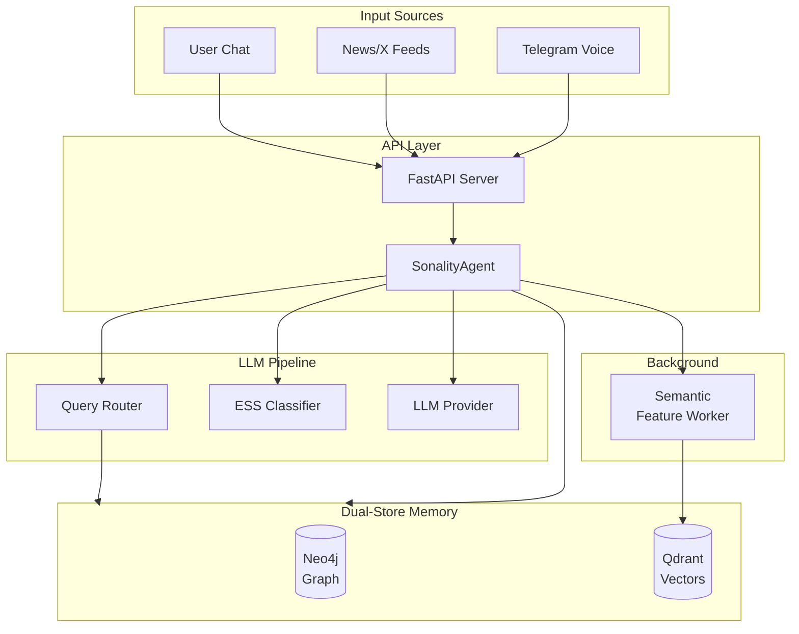
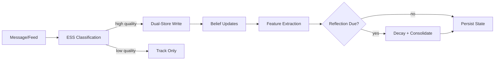

# Sonality Documentation

Sonality is a personality-evolving LLM agent with self-developing beliefs and identity. It uses a dual-store memory system (Neo4j graph + Qdrant vectors) combined with an Evidence Strength Score (ESS) that gates personality updates by argument quality.

## Core Principles

- **Evidence-gated updates**: Strong logical arguments shift views; social pressure and bare assertions are filtered
- **LLM-first decisions**: Belief updates, retrieval routing, and reflection all use structured LLM assessments
- **Dual-store memory**: Neo4j (graph structure) + Qdrant (vector search) for complementary retrieval
- **Sycophancy resistance**: Third-person ESS framing, manipulative reasoning filters, confidence floors

## Architecture Snapshot

```mermaid
flowchart TB
    subgraph input["Input Sources"]
        User[User Chat]
        Feeds[News/X Feeds]
        TG[Telegram Voice]
    end

    subgraph api["API Layer"]
        FastAPI[FastAPI Server]
        Agent[SonalityAgent]
    end

    subgraph llm["LLM Pipeline"]
        Router[Query Router]
        ESS[ESS Classifier]
        Provider[LLM Provider]
    end

    subgraph memory["Dual-Store Memory"]
        direction LR
        Neo4j[(Neo4j<br/>Graph)]
        Qdrant[(Qdrant<br/>Vectors)]
    end

    subgraph background["Background"]
        SemWorker[Semantic<br/>Feature Worker]
    end

    User --> FastAPI
    Feeds --> FastAPI
    TG --> FastAPI
    FastAPI --> Agent
    Agent --> Router
    Agent --> ESS
    Agent --> Provider
    Router --> memory
    Agent --> memory
    Agent --> SemWorker
    SemWorker --> Qdrant
```

## Key Components

| Component | Purpose |
|-----------|---------|
| **SonalityAgent** | Core orchestration: context → LLM → memory updates |
| **ESS Classifier** | Evaluates argument quality (0.0–1.0) with reasoning type |
| **Dual-Store** | Atomic Neo4j + Qdrant episode storage with rollback |
| **Query Router** | LLM-based retrieval strategy selection |
| **Semantic Worker** | Async personality feature extraction |
| **Reflection Engine** | Periodic belief decay, consolidation, snapshot updates |

## Data Pipeline

```mermaid
flowchart LR
    Input[Message/Feed] --> ESS[ESS Classification]
    ESS -->|high quality| Store[Dual-Store Write]
    ESS -->|low quality| Skip[Track Only]
    Store --> Beliefs[Belief Updates]
    Beliefs --> Features[Feature Extraction]
    Features --> Reflect{Reflection Due?}
    Reflect -->|yes| Consolidate[Decay + Consolidate]
    Reflect -->|no| Done[Persist State]
    Consolidate --> Done
```

## Quick Links

### Getting Started
- [Quick Start](getting-started.md) — Installation and first run
- [Configuration](configuration.md) — Environment variables and tuning

### Architecture
- [System Architecture](architecture/system-architecture.md) — **Comprehensive top-down system view**
- [System Integration Map](architecture/system-integration-map.md) — **Complete component interconnection diagram**
- [Module Inventory](architecture/module-inventory.md) — **Deep-dive: Complete module reference with line counts**
- [System Overview](architecture/overview.md) — Component breakdown and diagrams
- [Configuration & Schema](architecture/configuration-schema.md) — **Deep-dive: Config and schema definitions**
- [Agent Core](architecture/agent-core.md) — **Deep-dive: SonalityAgent code walkthrough**
- [CLI Interface](architecture/cli-interface.md) — **Deep-dive: Interactive REPL**
- [Agent Pipeline](architecture/agent-pipeline.md) — Detailed processing flow
- [Memory Subsystem](architecture/memory-subsystem.md) — Dual-store deep dive
- [Dual Store Operations](architecture/dual-store-operations.md) — **Deep-dive: Transaction semantics and rollback**
- [Graph Operations](architecture/graph-operations.md) — **Deep-dive: Neo4j MemoryGraph operations**
- [Database Schema](architecture/database-schema.md) — Neo4j + Qdrant complete schema reference
- [Retrieval Pipeline](architecture/retrieval-pipeline.md) — Query routing, chain/split retrieval, reranking
- [Advanced Retrieval](architecture/advanced-retrieval.md) — **Deep-dive: Reranker, chain, split strategies**
- [Knowledge Extraction](architecture/knowledge-extraction.md) — SLIDE-inspired proposition extraction
- [Segmentation](architecture/segmentation.md) — Event boundary detection and consolidation
- [ESS Classifier](architecture/ess-classifier.md) — **Deep-dive: Evidence strength classification system**
- [Belief Provenance](architecture/belief-provenance.md) — **Deep-dive: Belief evidence tracking**
- [Semantic Features Worker](architecture/semantic-features-worker.md) — **Deep-dive: Background feature extraction**
- [Forgetting System](architecture/forgetting-system.md) — **Deep-dive: LLM-based memory pruning**
- [Memory Lifecycle](architecture/memory-lifecycle.md) — **Deep-dive: Episode archival and forgetting**
- [Chunking & Derivatives](architecture/chunking-derivatives.md) — **Deep-dive: Semantic chunking for retrieval**
- [Embedder & Consolidation](architecture/embedder-consolidation.md) — **Deep-dive: Embedding and segment consolidation**
- [Database Connections](architecture/database-connections.md) — **Deep-dive: Neo4j + Qdrant lifecycle**
- [Data Flow](architecture/data-flow.md) — End-to-end data pipeline
- [Data Pipeline Trace](architecture/data-pipeline-trace.md) — **Complete end-to-end pipeline walkthrough**
- [Memory Model](architecture/memory-model.md) — Neo4j + Qdrant schema
- [API Layer](architecture/api-layer.md) — FastAPI endpoints and schemas
- [Prompt System](architecture/prompt-system.md) — All LLM prompt templates
- [Prompts Reference](architecture/prompts-reference.md) — **Complete prompt catalog with analysis**
- [LLM Caller](architecture/llm-caller.md) — Structured LLM calls with retry and repair
- [LLM Provider](architecture/llm-provider.md) — Provider abstraction and JSON parsing
- [Feed Ingestion](architecture/feed-ingestion.md) — RSS, GNews, and X feed scripts
- [Feed Scripts](architecture/feed-scripts.md) — **Deep-dive: Feed script implementation**
- [Chat System](architecture/chat-system.md) — **Deep-dive: Chat architecture with voice**
- [Chat Clients](architecture/chat-clients.md) — Terminal TUI and Telegram bot
- [Infrastructure](architecture/infrastructure.md) — Docker, deployment, databases

### Concepts
- [ESS (Evidence Strength Score)](concepts/ess.md) — Argument quality classification
- [ESS Deep Dive](concepts/ess-deep-dive.md) — Complete classifier reference
- [Belief System](concepts/belief-system.md) — Evidence and provenance tracking
- [Reflection](concepts/reflection.md) — Periodic consolidation and decay
- [Opinion Dynamics](concepts/opinion-dynamics.md) — Belief update mechanics
- [Anti-Sycophancy](concepts/anti-sycophancy.md) — Resistance mechanisms

### Reference
- [API Reference](api-reference.md) — HTTP endpoint documentation
- [Project Structure](project-structure.md) — Complete module inventory

### Testing
- [Testing Guide](testing.md) — Test suite overview
- [Testing Framework](testing/testing-framework.md) — Fixtures, mocking, testcontainers
- [Testing Infrastructure](testing/testing-infrastructure.md) — **Deep-dive: Containers, fixtures, mocking**
- [Scenario Runner](testing/scenario-runner.md) — **Deep-dive: Benchmark execution engine**
- [Benchmarks](testing/benchmarks.md) — Scenario contracts and multi-dimensional evaluation
- [Benchmark System](testing/benchmark-system.md) — **Deep-dive: Multi-dimensional evaluation system**
- [Composed Scenarios](testing/composed-scenarios.md) — **Deep-dive: C1-C6 integration benchmarks**
- [Live Scenarios](testing/live-scenarios.md) — **Deep-dive: ESS calibration, sycophancy resistance**
- [Knowledge Accumulation](testing/knowledge-accumulation.md) — **Deep-dive: Multi-domain teaching scenarios**
- [Test Suite Patterns](testing/test-suite-patterns.md) — **Deep-dive: Unit test patterns and mocking**

### Operations
- [Memory Diagnostics](operations/memory-diagnostics.md) — **Deep-dive: Health checks and orphan repair**

### Research
- [Background](research/background.md) — Academic foundations
- [References](research/references.md) — 200+ cited works

## Technology Stack

| Layer | Technology |
|-------|------------|
| Runtime | Python 3.12+ with FastAPI |
| Graph Store | Neo4j 5 |
| Vector Store | Qdrant |
| Embeddings | FastEmbed (BAAI/bge-large-en-v1.5, 1024d) |
| LLM | OpenAI-compatible API |
| Chat Clients | Terminal (Rich), Telegram (aiogram) |
| STT/TTS | Speaches (Whisper + Kokoro) |
