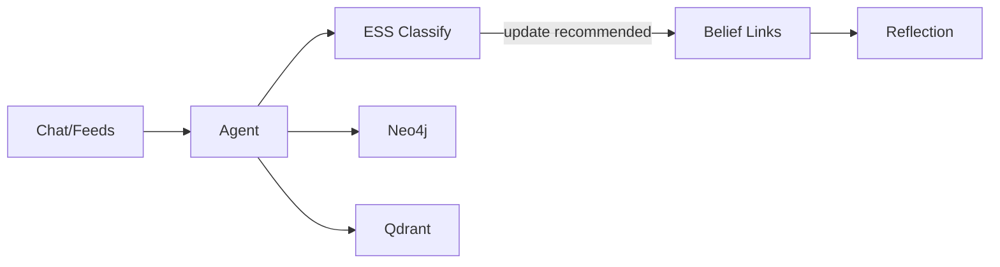

# Sonality

Personality-evolving LLM agent with self-developing beliefs via dual-store memory (Neo4j + Qdrant) and ESS gating.

## Architecture


```mermaid
flowchart LR
    Input[Chat/Feeds] --> Agent
    Agent --> ESS[ESS Classify]
    Agent --> Neo4j & Qdrant
    ESS -->|update recommended| Provenance[Belief Links]
    Provenance --> Reflect[Reflection]
```

**Flow:** Message → ESS → Dual-store → Provenance → Reflection (if triggered)

## Core Concepts

| Concept | Purpose |
|---------|---------|
| **ESS** | Argument quality score (0-1), gates belief updates |
| **Dual-Store** | Neo4j (graph) + Qdrant (vectors) |
| **Reflection** | Two-tier LLM belief consolidation |
| **Provenance** | Episode→Belief edges |

## Quick Start

```bash
make install && cp .env.example .env
docker compose up -d neo4j qdrant
make run
```

## Documentation

### Setup
- [Getting Started](getting-started.md)
- [Configuration](configuration.md)
- [API Reference](api-reference.md)

### Architecture
- [Overview](architecture/overview.md)
- [Data Flow](architecture/data-flow.md)
- [Memory](architecture/memory.md)
- [Retrieval](architecture/retrieval-pipeline.md)

### Concepts
- [ESS](concepts/ess.md)
- [Beliefs](concepts/beliefs.md)
- [Reflection](concepts/reflection.md)
- [Anti-Sycophancy](concepts/anti-sycophancy.md)

### Testing
- [Testing](testing.md)
- [Benchmarks](testing/benchmark-system.md)

### Reference
- [Project Structure](project-structure.md)
- [Prompts Reference](architecture/prompts-reference.md)

## Stack

Neo4j 5 | Qdrant | FastEmbed (bge-large-en-v1.5) | OpenAI-compatible API
