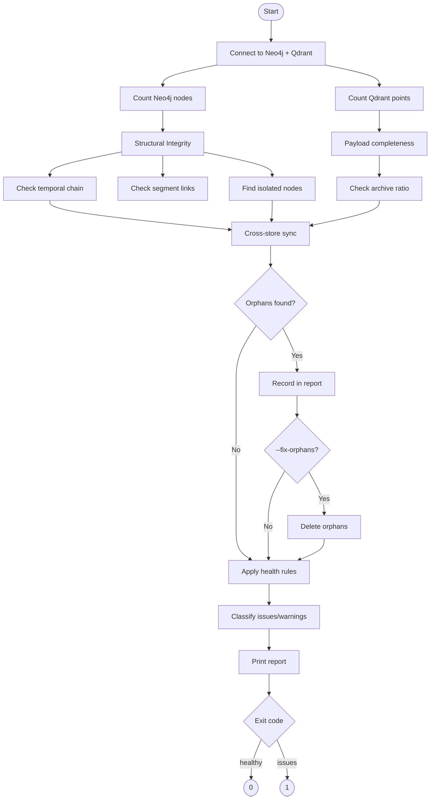

# Memory Diagnostics Deep-Dive

> **Location**: `scripts/memory_diagnostics.py`  
> **Purpose**: Health checks, consistency verification, and orphan detection for Neo4j + Qdrant

The memory diagnostics script provides comprehensive health monitoring and repair capabilities for the dual-store memory system.

## Architecture Overview

```
┌─────────────────────────────────────────────────────────────────────────┐
│                     Memory Diagnostics System                            │
├─────────────────────────────────────────────────────────────────────────┤
│                                                                         │
│  ┌──────────────────────────────────────────────────────────────────┐  │
│  │                    DiagnosticsReport                              │  │
│  │                                                                   │  │
│  │  Neo4j Counts    │  Qdrant Counts    │  Integrity Checks         │  │
│  │  ────────────    │  ────────────     │  ────────────────         │  │
│  │  • Episodes      │  • derivatives    │  • Orphan detection       │  │
│  │  • Derivatives   │    (total/active/ │  • Temporal chain gaps    │  │
│  │  • Segments      │     archived)     │  • Missing segments       │  │
│  │  • Topics        │  • semantic       │  • Isolated nodes         │  │
│  │  • Beliefs       │    _features      │  • Payload completeness   │  │
│  └──────────────────────────────────────────────────────────────────┘  │
│                                                                         │
│  ┌──────────────────────────────────────────────────────────────────┐  │
│  │                       Health Checks                               │  │
│  │                                                                   │  │
│  │  1. Cross-store sync     4. Payload completeness                 │  │
│  │  2. Temporal integrity   5. Isolation detection                  │  │
│  │  3. Segment linkage      6. Derivative density                   │  │
│  └──────────────────────────────────────────────────────────────────┘  │
│                                                                         │
└─────────────────────────────────────────────────────────────────────────┘
```

## Usage

```bash
# Basic diagnostics
uv run python scripts/memory_diagnostics.py

# Auto-fix detected orphans
uv run python scripts/memory_diagnostics.py --fix-orphans
```

## DiagnosticsReport Structure

```python
@dataclass
class DiagnosticsReport:
    # Neo4j node counts
    neo4j_episodes: int = 0
    neo4j_derivatives: int = 0
    neo4j_segments: int = 0
    neo4j_topics: int = 0
    neo4j_beliefs: int = 0
    
    # Qdrant collection counts
    qdrant_derivatives_total: int = 0
    qdrant_derivatives_active: int = 0
    qdrant_derivatives_archived: int = 0
    qdrant_semantic_features: int = 0
    
    # Cross-store consistency
    orphan_qdrant_only: list[str] = field(default_factory=list)
    orphan_neo4j_only: list[str] = field(default_factory=list)
    
    # Graph integrity
    temporal_chain_gaps: int = 0
    episodes_without_segments: int = 0
    
    # Payload completeness
    qdrant_missing_uid: int = 0
    qdrant_missing_content: int = 0
    
    # Node isolation
    isolated_topics: int = 0
    isolated_episodes: int = 0
    
    # Classification
    issues: list[str] = field(default_factory=list)
    warnings: list[str] = field(default_factory=list)
    
    @property
    def healthy(self) -> bool:
        return not self.issues
```

## Diagnostic Checks

### 1. Neo4j Node Counts

```python
async with driver.session(database=config.NEO4J_DATABASE) as session:
    for label, attr in [
        ("Episode", "neo4j_episodes"),
        ("Derivative", "neo4j_derivatives"),
        ("Segment", "neo4j_segments"),
        ("Topic", "neo4j_topics"),
        ("Belief", "neo4j_beliefs"),
    ]:
        result = await session.run(f"MATCH (n:{label}) RETURN count(n) AS cnt")
        record = await result.single()
        setattr(report, attr, record["cnt"] if record else 0)
```

### 2. Temporal Chain Integrity

```python
# Find episodes disconnected from temporal chain
result = await session.run("""
    MATCH (e:Episode)
    WHERE NOT (e)-[:TEMPORAL_NEXT]->()
      AND NOT (e)<-[:TEMPORAL_NEXT]-()
      AND EXISTS { MATCH (other:Episode) WHERE other.created_at > e.created_at }
    RETURN count(e) AS cnt
""")
```

**Issue Detection**: Episodes that should be linked temporally but aren't.

### 3. Segment Linkage

```python
# All episodes should belong to at least one segment
result = await session.run("""
    MATCH (e:Episode)
    WHERE NOT (e)-[:BELONGS_TO_SEGMENT]->()
    RETURN count(e) AS cnt
""")
```

**Issue Detection**: Episodes without segment associations indicate broken ingestion.

### 4. Isolated Node Detection

```python
# Topics with no incoming edges
result = await session.run("""
    MATCH (t:Topic)
    WHERE NOT ()-[:DISCUSSES]->(t)
    RETURN count(t) AS cnt
""")

# Episodes with no edges at all
result = await session.run("""
    MATCH (e:Episode)
    WHERE NOT (e)--()
    RETURN count(e) AS cnt
""")
```

### 5. Cross-Store Consistency

```python
# Get all derivative UIDs from both stores
qdrant_results, _ = await qdrant.scroll(
    collection_name="derivatives",
    limit=50000,
    with_payload=["uid"],
)
qdrant_uids = {str(p.payload.get("uid", "")) for p in qdrant_results if p.payload}
neo4j_uids = await graph.list_derivative_uids()

# Find orphans
orphan_qdrant = sorted(qdrant_uids - neo4j_uids)  # In Qdrant but not Neo4j
orphan_neo4j = sorted(neo4j_uids - qdrant_uids)   # In Neo4j but not Qdrant
```

### 6. Qdrant Payload Completeness

```python
# Sample up to 5000 points for missing required fields
sample_results, _ = await qdrant.scroll(
    collection_name="derivatives",
    limit=5000,
    with_payload=["uid", "text", "episode_uid"],
)
for point in sample_results:
    payload = point.payload or {}
    if not payload.get("uid"):
        report.qdrant_missing_uid += 1
    if not payload.get("text"):
        report.qdrant_missing_content += 1
```

## Health Assessment Rules

### Issues (Failures)

| Check | Condition | Message |
|-------|-----------|---------|
| Orphan Qdrant | `len(orphan_qdrant) > 0` | "N orphan derivatives in Qdrant (not in Neo4j)" |
| Orphan Neo4j | `len(orphan_neo4j) > 0` | "N orphan derivatives in Neo4j (not in Qdrant)" |
| No Derivatives | `episodes > 0 && derivatives == 0` | "Episodes exist but no derivatives — broken storage" |
| Low Density | `derivatives/episodes < 1.0` | "Low derivative density: X derivatives/episode" |
| Missing Segments | `episodes_without_segments > 0` | "N episodes have no segments" |
| Missing UID | `qdrant_missing_uid > 0` | "N Qdrant derivatives missing uid payload" |
| Isolated Episodes | `isolated_episodes > 0` | "N fully isolated Episode nodes" |

### Warnings (Non-Critical)

| Check | Condition | Message |
|-------|-----------|---------|
| High Archive Ratio | `active/total < 0.5` | "High archive ratio: X% archived" |
| High Density | `derivatives/episodes > 50` | "High derivative density: X/episode" |
| Temporal Gaps | `temporal_chain_gaps > 0` | "N episodes disconnected from temporal chain" |
| Missing Content | `qdrant_missing_content > 0` | "N derivatives missing text payload" |
| Isolated Topics | `isolated_topics > 5` | "N isolated Topic nodes" |

## Auto-Repair: --fix-orphans

```python
if fix_orphans:
    # Delete Qdrant-only orphans
    if orphan_qdrant:
        await qdrant.delete(
            collection_name="derivatives",
            points_selector=orphan_qdrant[:50],
        )
        log.info("Deleted %d Qdrant-only orphans", len(orphan_qdrant[:50]))
    
    # Delete Neo4j-only orphans
    if orphan_neo4j:
        await graph.delete_derivatives(orphan_neo4j[:50])
        log.info("Deleted %d Neo4j-only orphans", len(orphan_neo4j[:50]))
```

**Safety**: Only deletes up to 50 orphans per run to prevent accidental mass deletion.

## Diagnostic Flow



## Sample Output

```
── Memory Health Diagnostics ──────────────────────────────────
Status: ✓ HEALTHY

Neo4j:
  Episodes:    142
  Derivatives: 847
  Segments:    23
  Topics:      56
  Beliefs:     18

Qdrant:
  derivatives (total):    847
  derivatives (active):   823
  derivatives (archived): 24
  semantic_features:      156

Integrity:
  Temporal chain gaps:      0
  Episodes without segments:0
  Isolated topics:          2
  Isolated episodes:        0
  Qdrant missing uid:       0
  Qdrant missing content:   0

  No issues or warnings found.
```

## Integration with Operations

### Scheduled Health Checks

```bash
# Cron job for daily health check
0 3 * * * cd /app && uv run python scripts/memory_diagnostics.py >> /var/log/sonality/diagnostics.log 2>&1
```

### CI/CD Integration

```yaml
# GitHub Actions step
- name: Memory Health Check
  run: |
    uv run python scripts/memory_diagnostics.py
    if [ $? -ne 0 ]; then
      echo "Memory health check failed"
      exit 1
    fi
```

### Monitoring Integration

```python
# Prometheus metrics from DiagnosticsReport
memory_episodes_total.set(report.neo4j_episodes)
memory_derivatives_total.set(report.neo4j_derivatives)
memory_orphans_qdrant.set(len(report.orphan_qdrant_only))
memory_health_status.set(1 if report.healthy else 0)
```

## Related Documentation

- [Dual Store Operations](../architecture/dual-store-operations.md) - Transaction semantics
- [Graph Operations](../architecture/graph-operations.md) - Neo4j queries
- [Database Connections](../architecture/database-connections.md) - Connection lifecycle
- [Database Schema](../architecture/database-schema.md) - Schema definitions
