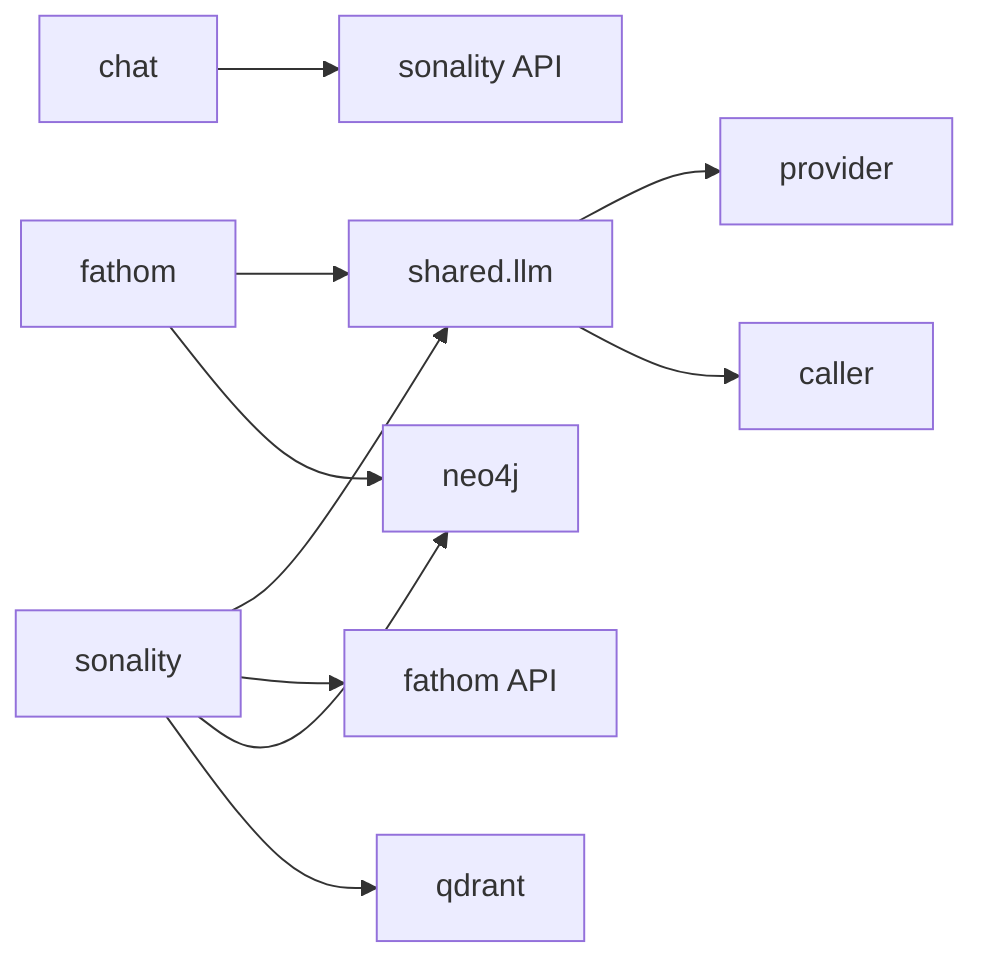

# Project Structure

```
src/
├── shared/                # Cross-package infrastructure
│   ├── config.py          # Env helpers, PROJECT_ROOT, logger quieting
│   ├── types.py           # ChatRole and common types
│   ├── neo4j.py           # Neo4j connect + verify + schema bootstrap
│   ├── server.py          # Shared uvicorn + argparse server launcher
│   └── llm/               # LLM transport layer
│       ├── provider.py    # LLMProvider (OpenAI-compatible HTTP)
│       ├── caller.py      # Structured llm_call with JSON repair
│       └── parse.py       # JSON extraction + decode helpers
├── sonality/              # LLM agent with self-evolving personality (port 8000)
│   ├── agent.py           # Orchestration + agentic loop
│   ├── api.py             # FastAPI server + serve()
│   ├── config.py          # Sonality env config
│   ├── ess.py             # ESS classifier
│   ├── prompts.py         # All prompt templates
│   ├── provider.py        # LLM provider instance
│   ├── progress.py        # AgentEvent and event constants
│   ├── llm/caller.py      # Sonality-specific structured LLM calls
│   ├── tools/             # Symmetric tool system
│   │   ├── web.py         # web_search, web_extract (via fathom)
│   │   ├── memory.py      # recall_memory, integrate_knowledge
│   │   ├── synthesize.py  # synthesize (evaluate + structure research)
│   │   └── reflect.py     # reflection + belief graph + forgetting
│   ├── web/               # Web I/O (fathom client)
│   │   └── client.py      # ResearchClient (HTTP + SSE for fathom)
│   └── memory/            # Graph + vector memory
│       ├── graph.py              # Neo4j (episodes, beliefs, snapshots)
│       ├── dual_store.py         # Atomic Neo4j + Qdrant storage
│       ├── derivatives.py        # Chunking + embedding
│       ├── semantic_features.py  # Feature extraction worker
│       ├── knowledge_extract.py  # Knowledge proposition extraction
│       ├── forgetting.py         # LLM-based memory forgetting
│       └── retrieval/            # router, chain, split, reranker
├── fathom/                # Autonomous web research agent (port 8010)
│   ├── api.py             # FastAPI server + lifespan + serve()
│   ├── config.py          # Fathom env config (FATHOM_* vars, no fallback)
│   ├── db.py              # Neo4j graph I/O (sessions, facts, frontier)
│   ├── llm.py             # LLM calls via shared.llm (async bridge)
│   ├── session.py         # Research loop (discovery + analysis + composition)
│   ├── browser.py         # Playwright pool for page fetching
│   ├── extract.py         # HTML → clean text via trafilatura
│   ├── search.py          # DuckDuckGo web search
│   ├── selection.py       # Probabilistic URL scoring + sampling
│   ├── models.py          # Pydantic models (API + internal)
│   ├── observe.py         # Rich dashboard + structlog setup
│   └── cli.py             # CLI for interactive research sessions
└── chat/                  # Terminal TUI + Telegram bot (port 8020 for STT/TTS)
    ├── client.py          # SonalityClient (streaming HTTP)
    ├── audio.py           # STT/TTS via Speaches API
    ├── terminal.py        # Rich TUI REPL
    └── telegram.py        # Telegram + voice streaming

tests/                     # pytest suite (49 tests)
├── shared/                # LLM provider timeout + retry tests
├── sonality/              # API contract, ESS parsing, chunking
├── fathom/                # Model normalization + LLM output edge cases
benches/                   # Benchmark contracts + live scenarios
docker/                    # Per-service Dockerfiles
docs/                      # Documentation (mirrors src/ layout)
```

## Dependency Graph



## Key Patterns

| Pattern | Location |
|---------|----------|
| Symmetric tool system | `sonality/tools/` (DEFINITIONS + EXECUTORS) |
| Structured LLM calls | `shared/llm/caller.py` |
| Neo4j bootstrap | `shared/neo4j.py` (connect + verify + schema) |
| Server launcher | `shared/server.py` (argparse + uvicorn) |
| Config isolation | `fathom/config.py` uses `FATHOM_*`, `sonality/config.py` uses `SONALITY_*` |
| HTTP + SSE delegation | `sonality/web/client.py` → `fathom/api.py` |
| Graph research state | `fathom/db.py` (Neo4j Cypher) |
| Dual-write atomicity | `sonality/memory/dual_store.py` |
| Resilient LLM models | `fathom/models.py` (normalizers for LLM output) |
