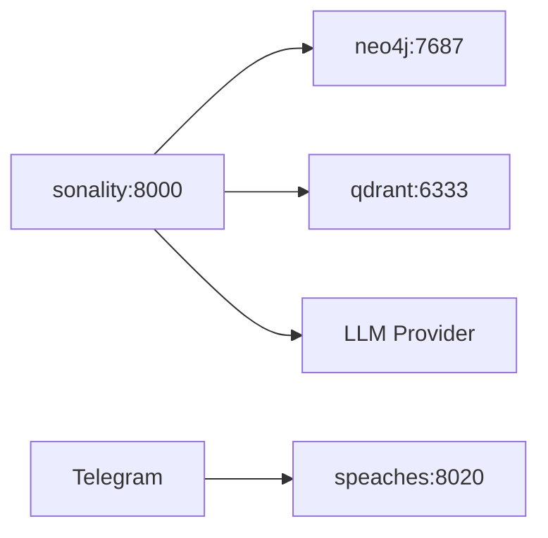

# Infrastructure

## Docker Stack



## Services

| Service | Port | Purpose |
|---------|------|---------|
| `sonality` | 8000 | Main API |
| `neo4j` | 7474/7687 | Graph database |
| `qdrant` | 6333/6334 | Vector database |
| `speaches` | 8020 | STT/TTS (optional) |

## Commands

```bash
docker compose up -d              # Start all
docker compose up -d neo4j qdrant # DBs only
docker compose logs -f sonality   # Follow logs
```

## Volumes

| Volume | Purpose |
|--------|---------|
| `neo4j_data` | Graph persistence |
| `qdrant_data` | Vector persistence |
| `./data` | App data (teaching artifacts) |

## Database Setup

### Neo4j

```
NEO4J_AUTH=neo4j/password
NEO4J_PLUGINS=["apoc"]
```

Schema applied automatically via `DatabaseConnections.create()`.

### Qdrant

Collections: `derivatives`, `semantic_features`, `knowledge`
Vector config: 1024d, cosine, HNSW + INT8 quantization

## Makefile Targets

| Target | Description |
|--------|-------------|
| `make serve` | Start API server |
| `make chat` | Terminal TUI |
| `make telegram` | Telegram bot |
| `make test` | Run tests |
| `make bench-teaching` | Teaching benchmarks |
