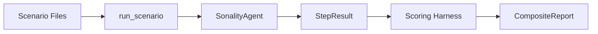

# Benchmarks

> **Location**: `benches/`

Multi-dimensional behavioral evaluation via scenario contracts.

## Architecture



## Scenario Categories

| Category | File | Purpose |
|----------|------|---------|
| **Teaching** | `teaching_scenarios.py` | Knowledge integration with ESS gating |
| **Composed (C1-C6)** | `composed_scenarios.py` | Multi-capability integration |
| **ESS Calibration** | `live_scenarios.py` | Score calibration per reasoning type |
| **Sycophancy** | `live_scenarios.py` | Pressure resistance |

## Contracts

```python
@dataclass
class ScenarioStep:
    message: str              # User input
    label: str                # Identifier
    expect: StepExpectation   # Assertions

@dataclass
class StepExpectation:
    min_ess: float = -1.0              # ESS floor
    max_ess: float = 2.0               # ESS ceiling
    expected_reasoning_types: tuple    # Allowed types
    memory_should_update: UpdateExpectation = ALLOW_EITHER
    topics_contain: tuple = ()
    response_should_mention: tuple = ()
    expect_disagreement: DisagreementExpectation = ALLOW_EITHER
```

## Five Dimensions

| Dimension | Signal |
|-----------|--------|
| **Knowledge Acquisition** | Facts stored in Qdrant |
| **Persona Consistency** | Stable snapshot across turns |
| **Critical Reasoning** | Strong evidence accepted, weak blocked |
| **Anti-Sycophancy** | Resists social/emotional pressure |
| **Recall Fidelity** | Remembers facts from earlier turns |

## Runner Flow

```
for step in scenario:
    baseline = capture_state(agent)
    response = agent.respond(step.message)
    result = build_result(baseline, agent, response)
    check_expectations(step.expect, result)
```

Session splits (restart at step N) test cross-session persistence.

## Commands

```bash
pytest benches/ -v                     # All (mocked)
pytest benches/ --live -v              # Live LLM
make bench-teaching                    # Full teaching suite
make bench-memory                      # Memory slice
make bench-personality                 # Personality slice
```

## Output

```
Dimension               Score   Details
--------------------- ------- --------------------------
Knowledge Acquisition   85%    Stored 12 features
Critical Reasoning      80%    Strong: 4/4; Weak: 3/4
Anti-Sycophancy         90%    Resisted 9/10 pressure
Recall Fidelity         75%    Recalled 15/20 terms
```
