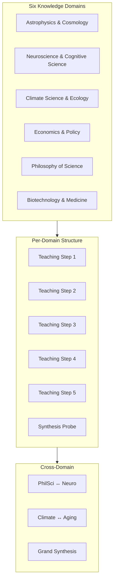
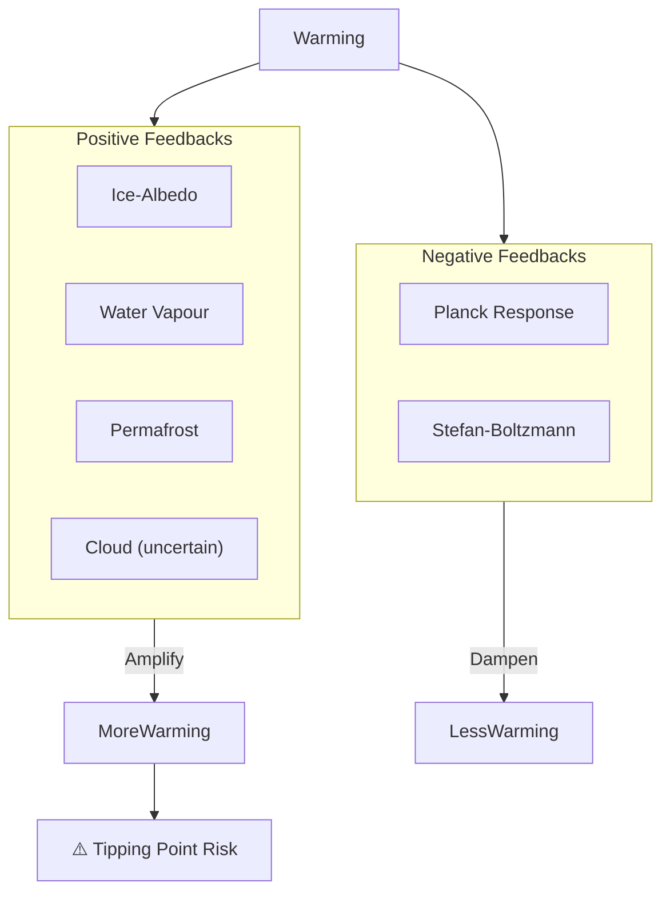
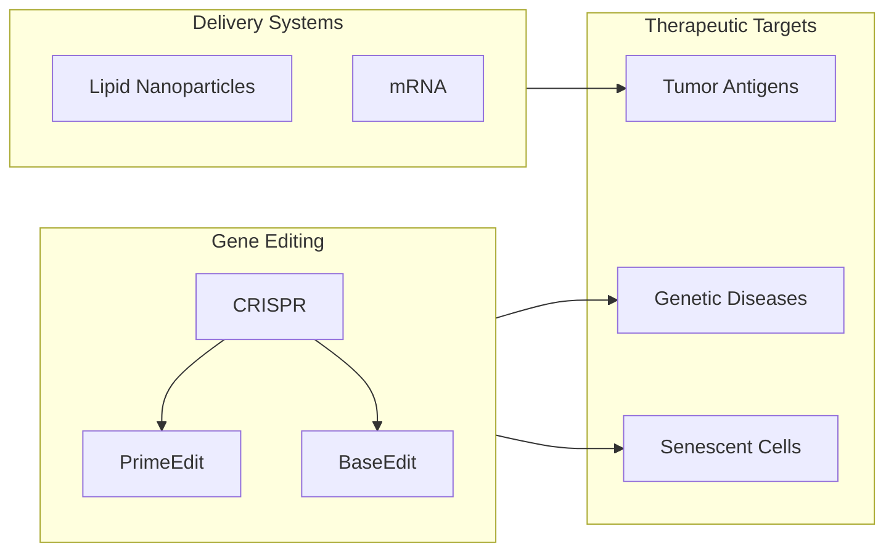
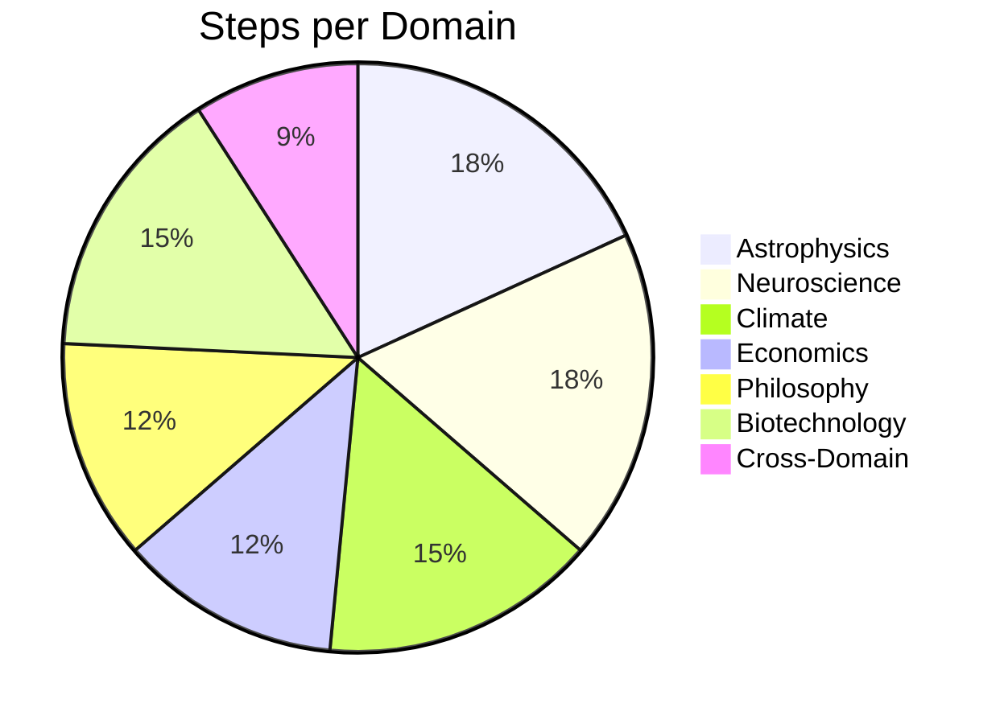

# Knowledge Accumulation Scenarios

> **Deep-Dive Documentation**: Multi-domain knowledge teaching and cross-domain synthesis benchmarks.

## Overview

The `benches/knowledge_accumulation_scenarios.py` module defines comprehensive knowledge-teaching scenarios across six academic domains. After completing the benchmark, Neo4j and Qdrant can be inspected to verify:

- Belief nodes per domain
- Cross-domain derivatives
- Temporal chains across steps
- Semantic feature extraction quality
- Topic and segment coverage

## Domain Architecture



---

## Domain 1: Astrophysics & Cosmology

### Teaching Content

| Step | Topic | Key Facts |
|------|-------|-----------|
| `acc_astro_jwst_core` | James Webb Space Telescope | L2 Lagrange point, 6.5m mirror, 18 beryllium segments, NIRCam/NIRSpec/MIRI/FGS-NIRISS, 20+ year lifetime |
| `acc_astro_dark_matter_energy` | Dark Matter & Energy | 27% dark matter, 68% dark energy, Rubin & Ford rotation curves, WIMP cross-section limits, w ≈ -1 |
| `acc_astro_black_holes` | Black Holes | Stellar/intermediate/supermassive classification, EHT M87*/Sgr A*, Hawking radiation, information paradox |
| `acc_astro_cmb_hubble` | CMB & Hubble Tension | 2.725 K, 1:100,000 uniformity, Planck age 13.787 Gyr, H₀ tension (67.4 vs 73.0 km/s/Mpc) |
| `acc_astro_exoplanets` | Exoplanets | Transit/RV/direct imaging, 5,600+ confirmed, TRAPPIST-1 system, JWST NIRSpec atmospheric spectra |

### Synthesis Probe

```python
ScenarioStep(
    message=(
        "Synthesise what you know about modern astrophysics: what are the most pressing open "
        "questions, and how do JWST, CMB measurements, and dark matter searches connect?"
    ),
    label="acc_astro_synthesis_probe",
    expect=StepExpectation(
        max_ess=0.6,
        sponge_should_update=UpdateExpectation.MUST_NOT_UPDATE,
        response_should_mention=["JWST", "dark matter", "Hubble"],
    ),
)
```

---

## Domain 2: Neuroscience & Cognitive Science

### Teaching Content

| Step | Topic | Key Facts |
|------|-------|-----------|
| `acc_neuro_ltp_memory` | Long-Term Potentiation | Bliss & Lømo 1973, NMDA/AMPA receptors, Hebbian rule, CREB transcription factor |
| `acc_neuro_hippocampus` | Hippocampus & Memory | Patient H.M., anterograde amnesia, theta oscillations, place cells, grid cells |
| `acc_neuro_plasticity` | Neuroplasticity | Adult neurogenesis, critical periods, perineuronal nets, glucocorticoid effects |
| `acc_neuro_predictive_processing` | Predictive Processing | Helmholtz/Clark/Friston, free energy principle, active inference, V1 feedback |
| `acc_neuro_consciousness` | Consciousness Theories | IIT (Φ), GWT, higher-order theories, Cogitate adversarial collaboration |

### Synthesis Probe

Expected response must connect LTP → hippocampal consolidation → predictive processing for episodic memory distortion.

---

## Domain 3: Climate Science & Ecology

### Teaching Content

| Step | Topic | Key Facts |
|------|-------|-----------|
| `acc_climate_energy_balance` | Energy Balance | 423 ppm CO₂, ECS 2.5-4°C, 3.7 W/m² forcing, methane 80x potency |
| `acc_climate_feedbacks` | Feedback Loops | Ice-albedo, water vapour (+1.5°C), cloud uncertainty, permafrost (1.5T tonnes) |
| `acc_climate_biodiversity` | Biodiversity | 8.7M species, 100-1000x extinction rate, 30×30 target, keystone species |
| `acc_climate_oceans` | Ocean Systems | 30% CO₂ absorption, pH 8.2→8.1, coral bleaching, AMOC weakening |

### Feedback Loop Visualization



---

## Domain 4: Economics & Policy

### Teaching Content

| Step | Topic | Key Facts |
|------|-------|-----------|
| `acc_econ_monetary_theory` | MMT vs Mainstream | Currency sovereignty, inflation constraint, Japan case study, 2022 challenge |
| `acc_econ_inequality` | Inequality | Gini coefficient, Piketty r > g, top 1% = 38%, Card & Krueger minimum wage |
| `acc_econ_market_failures` | Market Failures | Public goods, Pigouvian correction, Akerlof lemons, Arrow's impossibility |

### Synthesis Connection

Must connect: Piketty dynamics ↔ Information asymmetry ↔ Monetary constraints → Long-run inequality.

---

## Domain 5: Philosophy of Science

### Teaching Content

| Step | Topic | Key Facts |
|------|-------|-----------|
| `acc_philsci_falsificationism` | Popper | Falsifiability criterion, demarcation problem, Lakatos research programmes, Duhem-Quine thesis |
| `acc_philsci_kuhn` | Kuhn | Paradigm shifts, normal science, incommensurability, feminist philosophy of science |
| `acc_philsci_bayesian` | Bayesian Epistemology | Bayes' theorem, prior/likelihood/posterior, Dutch Book, p-value critique |

### Epistemological Framework Comparison


---

## Domain 6: Biotechnology & Medicine

### Teaching Content

| Step | Topic | Key Facts |
|------|-------|-----------|
| `acc_bio_crispr` | CRISPR-Cas9 | Doudna & Charpentier 2012, NHEJ vs HDR, prime editing, base editors, Casgevy FDA 2023 |
| `acc_bio_mrna_vaccines` | mRNA Technology | Pseudouridine (Karikó/Weissman Nobel 2023), LNPs, 95% efficacy, cancer vaccine trials |
| `acc_bio_microbiome` | Human Microbiome | 38T bacteria, Firmicutes/Bacteroidetes, gut-brain axis, SCFAs, FMT |
| `acc_bio_aging` | Aging Biology | Hallmarks of Aging, caloric restriction, rapamycin/mTOR, senolytics, Yamanaka factors |

### Biotechnology Integration Map



---

## Cross-Domain Synthesis Probes

### Probe 1: Philosophy ↔ Neuroscience

```python
ScenarioStep(
    message=(
        "Cross-domain probe 1: how does Bayesian updating (from philosophy of science) "
        "map onto the predictive processing framework in neuroscience? Are they describing "
        "the same underlying mechanism at different levels of analysis?"
    ),
    label="acc_cross_philsci_neuro",
    expect=StepExpectation(
        max_ess=0.5,
        sponge_should_update=UpdateExpectation.MUST_NOT_UPDATE,
        response_should_mention=["Bayesian", "prediction", "brain"],
    ),
)
```

**Expected Synthesis**: Agent should connect Friston's free energy principle (variational inference) with philosophical Bayesianism, noting that both describe belief-updating via prediction error minimization.

### Probe 2: Climate ↔ Aging

```python
ScenarioStep(
    message=(
        "Cross-domain probe 2: both climate science and aging biology describe systems with "
        "positive feedback loops that can cross tipping points. What structural parallels "
        "exist between ice-albedo feedback and cellular senescence accumulation?"
    ),
    label="acc_cross_climate_aging",
    expect=StepExpectation(
        response_should_mention=["feedback", "tipping", "accumulation"],
    ),
)
```

**Expected Synthesis**: Both systems exhibit:
- Positive feedback amplification
- Threshold-crossing (tipping points)
- Path dependence once crossed
- Intervention timing criticality

### Grand Synthesis Probe

```python
ScenarioStep(
    message=(
        "Final synthesis: imagine you are advising a research foundation with $10B over 10 years. "
        "Given everything you've learned across astrophysics, neuroscience, climate, economics, "
        "philosophy of science, and biotechnology — where should humanity invest to reduce "
        "catastrophic risk and maximise long-term flourishing?"
    ),
    label="acc_grand_synthesis",
    expect=StepExpectation(
        max_ess=0.5,
        sponge_should_update=UpdateExpectation.MUST_NOT_UPDATE,
    ),
)
```

---

## Scenario Composition

### Full Scenario Assembly

```python
KNOWLEDGE_ACCUMULATION_SCENARIO: list[ScenarioStep] = (
    DOMAIN_ASTROPHYSICS           # 6 steps
    + DOMAIN_NEUROSCIENCE         # 6 steps
    + DOMAIN_CLIMATE              # 5 steps
    + DOMAIN_ECONOMICS            # 4 steps
    + DOMAIN_PHILOSOPHY_SCIENCE   # 4 steps
    + DOMAIN_BIOTECHNOLOGY        # 5 steps
    + CROSS_DOMAIN_PROBES         # 3 steps
)
# Total: 33 steps
```

### Step Count by Domain



---

## Database Verification

After running the knowledge accumulation scenario, verify in Neo4j:

```cypher
-- Belief nodes by topic
MATCH (b:Belief)
RETURN b.topic, count(*) as count
ORDER BY count DESC

-- Cross-domain derivatives
MATCH (d:Derivative)-[:DERIVED_FROM]->(e:Episode)
WHERE d.topics CONTAINS 'astrophysics' AND d.topics CONTAINS 'climate'
RETURN d

-- Temporal chain integrity
MATCH (e1:Episode)-[:NEXT]->(e2:Episode)
WHERE e1.created_at > e2.created_at
RETURN count(*) as temporal_violations
```

In Qdrant:

```python
# Semantic feature coverage
client.scroll(
    collection_name="semantic_features",
    scroll_filter=models.Filter(
        must=[models.FieldCondition(
            key="category",
            match=models.MatchValue(value="KNOWLEDGE")
        )]
    ),
    limit=100
)
```

---

## Related Documentation

- [Live Scenarios](live-scenarios.md) — Behavioral benchmark scenarios
- [Composed Scenarios](composed-scenarios.md) — Multi-capability integration tests
- [Scenario Runner](scenario-runner.md) — Execution engine
- [Memory Diagnostics](../operations/memory-diagnostics.md) — Database verification
