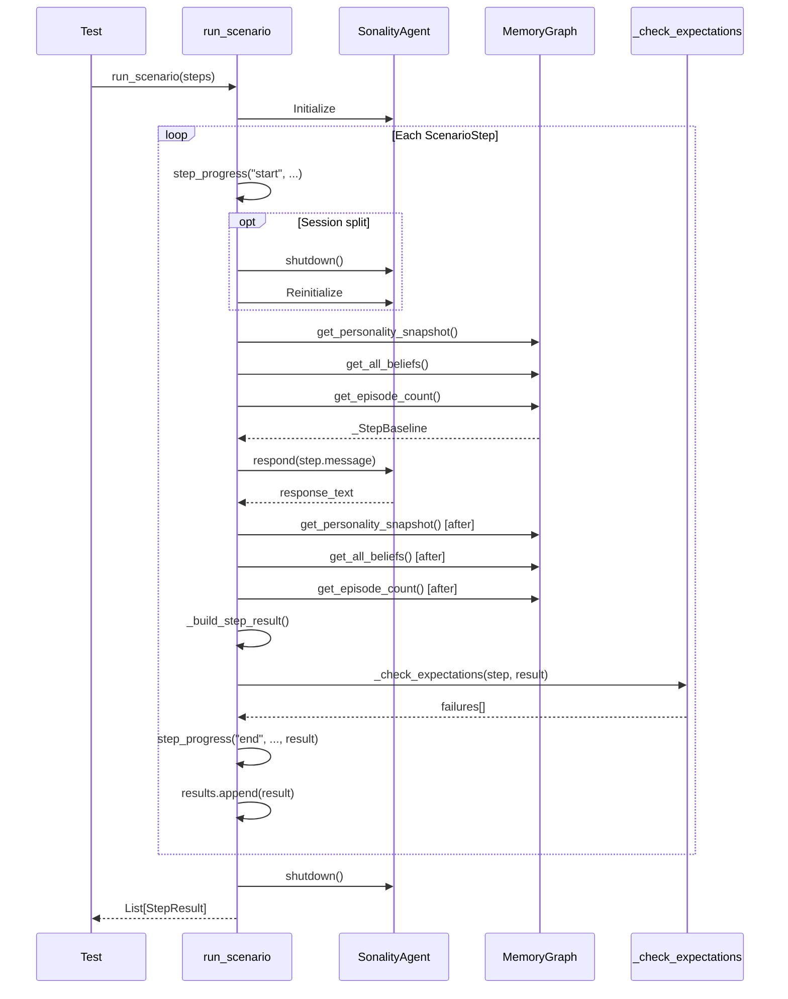

# Scenario Runner Deep-Dive

> **Location**: `benches/scenario_runner.py`  
> **Purpose**: Core execution engine for behavioral benchmarks

The scenario runner executes multi-step test scenarios against the live agent, capturing detailed state transitions and evaluating expectation contracts.

## Architecture Overview

```
┌─────────────────────────────────────────────────────────────────────────┐
│                      Scenario Runner Architecture                        │
├─────────────────────────────────────────────────────────────────────────┤
│                                                                         │
│  ┌──────────────────┐  ┌──────────────────┐  ┌──────────────────┐     │
│  │  ScenarioStep    │  │  StepBaseline    │  │   StepResult     │     │
│  │  (Input)         │  │  (Pre-state)     │  │   (Output)       │     │
│  │                  │  │                  │  │                  │     │
│  │  • message       │  │  • episode_count │  │  • ess_score     │     │
│  │  • label         │  │  • personality_  │  │  • sponge_version│     │
│  │  • expect        │  │    version       │  │  • snapshot_*    │     │
│  │                  │  │  • snapshot      │  │  • beliefs       │     │
│  │                  │  │  • beliefs       │  │  • failures      │     │
│  └──────────────────┘  └──────────────────┘  └──────────────────┘     │
│                                                                         │
│  ┌──────────────────────────────────────────────────────────────────┐  │
│  │                    run_scenario() Loop                            │  │
│  │                                                                   │  │
│  │  for step in scenario:                                           │  │
│  │    1. capture_baseline(agent)                                    │  │
│  │    2. response = agent.respond(step.message)                     │  │
│  │    3. result = build_step_result(step, agent, response, baseline)│  │
│  │    4. check_expectations(step, result)                           │  │
│  │    5. results.append(result)                                     │  │
│  └──────────────────────────────────────────────────────────────────┘  │
│                                                                         │
└─────────────────────────────────────────────────────────────────────────┘
```

## Core Data Structures

### StepResult

```python
@dataclass(slots=True)
class StepResult:
    """Per-step benchmark artifact used by harness gates and reporting."""
    
    # Identification
    label: str
    
    # ESS Classification
    ess_score: float
    ess_reasoning_type: str
    ess_opinion_direction: str
    ess_used_defaults: bool
    ess_defaulted_fields: tuple[str, ...] = ()
    ess_default_severity: str = "none"
    
    # Memory State
    sponge_version_before: int
    sponge_version_after: int
    snapshot_before: str
    snapshot_after: str
    
    # Belief State
    disagreement_before: float
    disagreement_after: float
    did_disagree: bool
    opinion_vectors: dict[str, float]
    topics_tracked: dict[str, int]
    
    # Response
    response_text: str
    
    # State Changes
    memory_update_observed: bool = False
    memory_write_observed: bool = False
    opinion_vectors_changed: bool = False
    staged_updates_added: bool = False
    staged_updates_committed: bool = False
    
    # Counts
    staged_updates_before: int = 0
    staged_updates_after: int = 0
    pending_insights_before: int = 0
    pending_insights_after: int = 0
    knowledge_writes: int = 0
    interaction_count_before: int = 0
    interaction_count_after: int = 0
    episode_count_before: int = 0
    episode_count_after: int = 0
    
    # LLM Usage
    response_calls: int = 0
    ess_calls: int = 0
    response_input_tokens: int = 0
    response_output_tokens: int = 0
    ess_input_tokens: int = 0
    ess_output_tokens: int = 0
    
    # Evaluation
    passed: bool = True
    failures: list[str] = field(default_factory=list)
```

### StepBaseline

```python
@dataclass(frozen=True, slots=True)
class _StepBaseline:
    """Pre-step state used to build one step result."""
    
    episode_count: int
    personality_version: int
    snapshot: str
    beliefs: dict[str, float]
```

## Main Execution Function

```python
def run_scenario(
    scenario: Sequence[ScenarioStep],
    neo4j_url: str | None = None,
    qdrant_url: str | None = None,
    session_split_at: int = NO_SESSION_SPLIT,
    step_progress: StepProgressCallback = NO_STEP_PROGRESS,
    ess_min_slack: float = 0.0,
    ess_max_slack: float = 0.0,
) -> list[StepResult]:
    """Run a scenario with an optional session restart boundary.
    
    Args:
        scenario: Sequence of steps to execute.
        neo4j_url: Optional Neo4j URL override.
        qdrant_url: Optional Qdrant URL override.
        session_split_at: Index to restart agent (simulates session break).
        step_progress: Callback for progress updates.
        ess_min_slack: Tolerance for ESS minimum thresholds.
        ess_max_slack: Tolerance for ESS maximum thresholds.
    
    Returns:
        List of StepResult objects for each scenario step.
    """
```

### Execution Flow

```python
from sonality.agent import SonalityAgent

agent = SonalityAgent()
try:
    results: list[StepResult] = []
    
    for idx, step in enumerate(scenario):
        step_index = idx + 1
        step_progress("start", step_index, scenario_len, step, "start")
        
        # Optional session restart (simulates conversation break)
        if idx == split_index:
            agent.shutdown()
            agent = SonalityAgent()
        
        # Capture pre-step state
        before = _capture_step_baseline(agent)
        
        try:
            # Execute step
            response = agent.respond(step.message)
            
            # Build result from state delta
            result = _build_step_result(
                step=step, agent=agent, response=response, before=before
            )
            
            # Evaluate expectations
            _check_expectations(
                step, result,
                ess_min_slack=ess_min_slack,
                ess_max_slack=ess_max_slack,
            )
        except Exception as exc:
            raise RuntimeError(
                f"Scenario step failed ({step_index}/{scenario_len}, label='{step.label}')"
            ) from exc
        
        step_progress("end", step_index, scenario_len, step, result)
        results.append(result)
    
    return results
finally:
    agent.shutdown()
```

## State Capture

### Baseline Capture

```python
def _capture_step_baseline(agent: SonalityAgent) -> _StepBaseline:
    """Capture pre-step state used for result deltas."""
    snapshot = agent._run_async(agent._graph.get_personality_snapshot())
    beliefs = agent._run_async(agent._graph.get_all_beliefs())
    episode_count = agent._run_async(agent._graph.get_episode_count())
    
    return _StepBaseline(
        episode_count=episode_count,
        personality_version=snapshot.version,
        snapshot=snapshot.text,
        beliefs={b.topic: b.valence for b in beliefs},
    )
```

### Result Building

```python
def _build_step_result(
    step: ScenarioStep,
    agent: SonalityAgent,
    response: str,
    before: _StepBaseline,
) -> StepResult:
    """Build one benchmark step artifact from pre/post agent state."""
    ess = agent.last_ess
    usage = getattr(agent, "last_usage", None)
    
    # Capture post-step state
    snapshot_after = agent._run_async(agent._graph.get_personality_snapshot())
    beliefs_after = agent._run_async(agent._graph.get_all_beliefs())
    episode_count_after = agent._run_async(agent._graph.get_episode_count())
    
    # Build beliefs dictionaries
    beliefs_dict = {b.topic: b.valence for b in beliefs_after}
    topics_dict = {b.topic: b.evidence_count for b in beliefs_after}
    
    # Detect state changes
    opinions_changed = before.beliefs.keys() != beliefs_dict.keys() or any(
        abs(beliefs_dict.get(t, 0) - v) > 1e-9 for t, v in before.beliefs.items()
    )
    version_bumped = snapshot_after.version > before.personality_version
    episode_added = episode_count_after > before.episode_count
    
    memory_update_observed = version_bumped or opinions_changed or episode_added
    memory_write_observed = episode_added or opinions_changed
    
    # Check knowledge writes
    knowledge_writes = getattr(agent, "last_knowledge_writes", 0)
    if knowledge_writes > 0:
        memory_write_observed = True
    
    return StepResult(
        label=step.label,
        ess_score=ess.score if ess else -1.0,
        ess_reasoning_type=ess.reasoning_type.value if ess else "unknown",
        # ... all other fields
    )
```

## Expectation Checking

### Main Check Function

```python
def _check_expectations(
    step: ScenarioStep,
    result: StepResult,
    *,
    ess_min_slack: float = 0.0,
    ess_max_slack: float = 0.0,
) -> None:
    """Evaluate scenario expectations and append any contract failures."""
    e = step.expect
    
    _append_ess_threshold_failures(e, result, ess_min_slack=ess_min_slack, ess_max_slack=ess_max_slack)
    _append_reasoning_direction_failures(e, result)
    _append_update_policy_failures(e, result)
    _append_disagreement_failures(e, result)
    _append_topics_contain_failures(e, result)
    _append_snapshot_text_failures(e, result)
    _append_response_text_failures(e, result)
    
    if result.failures:
        result.passed = False
```

### ESS Threshold Checking

```python
def _append_ess_threshold_failures(
    e: StepExpectation,
    result: StepResult,
    *,
    ess_min_slack: float,
    ess_max_slack: float,
) -> None:
    """Append ESS min/max threshold failures."""
    min_slack = max(ess_min_slack, 0.0)
    max_slack = max(ess_max_slack, 0.0)
    effective_min_ess = max(MIN_ESS_UNSET, e.min_ess - min_slack)
    effective_max_ess = min(MAX_ESS_UNSET, e.max_ess + max_slack)
    
    if e.min_ess > MIN_ESS_UNSET and result.ess_score < effective_min_ess:
        result.failures.append(
            f"ESS {result.ess_score:.2f} < min {e.min_ess}"
            + (f" (effective {effective_min_ess:.2f})" if effective_min_ess != e.min_ess else "")
        )
    
    if e.max_ess < MAX_ESS_UNSET and result.ess_score > effective_max_ess:
        result.failures.append(f"ESS {result.ess_score:.2f} > max {e.max_ess}")
```

### Memory Update Policy Checking

```python
def _append_update_policy_failures(e: StepExpectation, result: StepResult) -> None:
    """Append memory-update policy failures."""
    if e.sponge_should_update is UpdateExpectation.MUST_UPDATE and not result.memory_write_observed:
        result.failures.append("Memory should have updated but did not")
    
    if e.sponge_should_update is UpdateExpectation.MUST_NOT_UPDATE:
        opinion_update_observed = (
            result.opinion_vectors_changed
            or result.staged_updates_added
            or result.pending_insights_after > result.pending_insights_before
        )
        if opinion_update_observed:
            update_signals: list[str] = []
            if result.sponge_version_after > result.sponge_version_before:
                update_signals.append(f"version v{result.sponge_version_before}->v{result.sponge_version_after}")
            if result.opinion_vectors_changed:
                update_signals.append("beliefs changed")
            result.failures.append(
                "Memory should NOT have updated but did"
                + (f" ({', '.join(update_signals)})" if update_signals else "")
            )
```

### Response Text Matching

```python
TEXT_TOKEN_PATTERN: Final = re.compile(r"[a-z0-9]+")

def _normalize_text_for_match(text: str) -> str:
    """Normalize text into lowercase alphanumeric tokens for robust matching."""
    return " ".join(TEXT_TOKEN_PATTERN.findall(text.lower()))

def _contains_term(normalized_text: str, term: str) -> bool:
    """Check if a normalized term phrase is present in normalized text."""
    normalized_term = _normalize_text_for_match(term)
    return bool(normalized_term) and normalized_term in normalized_text

def _append_response_text_failures(e: StepExpectation, result: StepResult) -> None:
    """Append response mention/non-mention contract failures."""
    normalized_response = _normalize_text_for_match(result.response_text)
    
    if e.response_should_mention and not any(
        _contains_term(normalized_response, term) for term in e.response_should_mention
    ):
        result.failures.append(
            f"Response should mention one of {e.response_should_mention} but did not"
        )
    
    for term in e.response_should_mention_all:
        if not _contains_term(normalized_response, term):
            result.failures.append(f"Response should mention '{term}' but does not")
    
    for term in e.response_should_not_mention:
        if _contains_term(normalized_response, term):
            result.failures.append(f"Response should NOT mention '{term}' but does")
```

## Execution Flow Diagram



## Progress Callback

```python
StepProgressEvent = Literal["start", "end"]
StepProgressCallback = Callable[[StepProgressEvent, int, int, ScenarioStep, object], None]

# Example usage
def my_progress(event, step_index, total_steps, step, payload):
    if event == "start":
        print(f"Starting step {step_index}/{total_steps}: {step.label}")
    else:
        result = payload
        status = "✓" if result.passed else "✗"
        print(f"{status} Completed {step.label} (ESS={result.ess_score:.2f})")

results = run_scenario(scenario, step_progress=my_progress)
```

## Session Split Feature

```python
# Simulate conversation break at step 5
results = run_scenario(
    scenario=C1_SCENARIO,
    session_split_at=5,
)
```

**Purpose**: Tests knowledge persistence across agent restarts.

## Related Documentation

- [Benchmark System](benchmark-system.md) - Multi-dimensional scoring
- [Scenario Contracts](scenario-contracts.md) - Step expectations
- [Testing Infrastructure](testing-infrastructure.md) - Test framework
- [Agent Core](../architecture/agent-core.md) - Agent implementation
