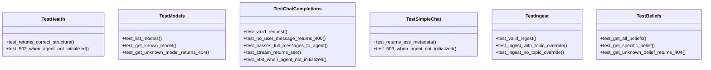
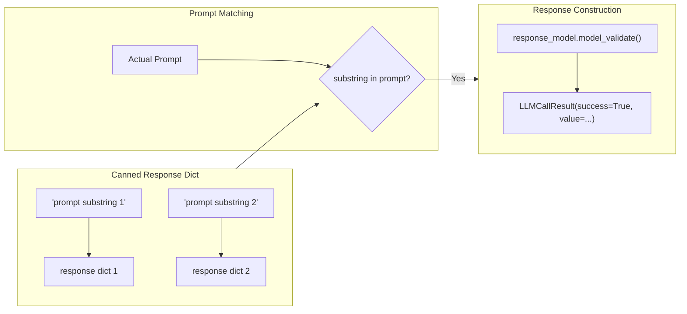
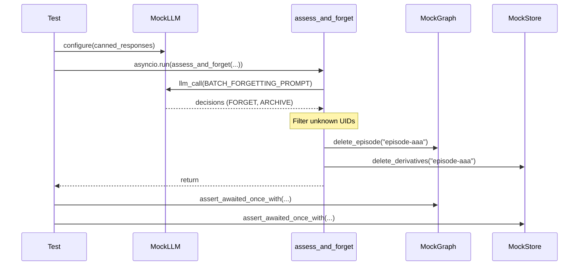
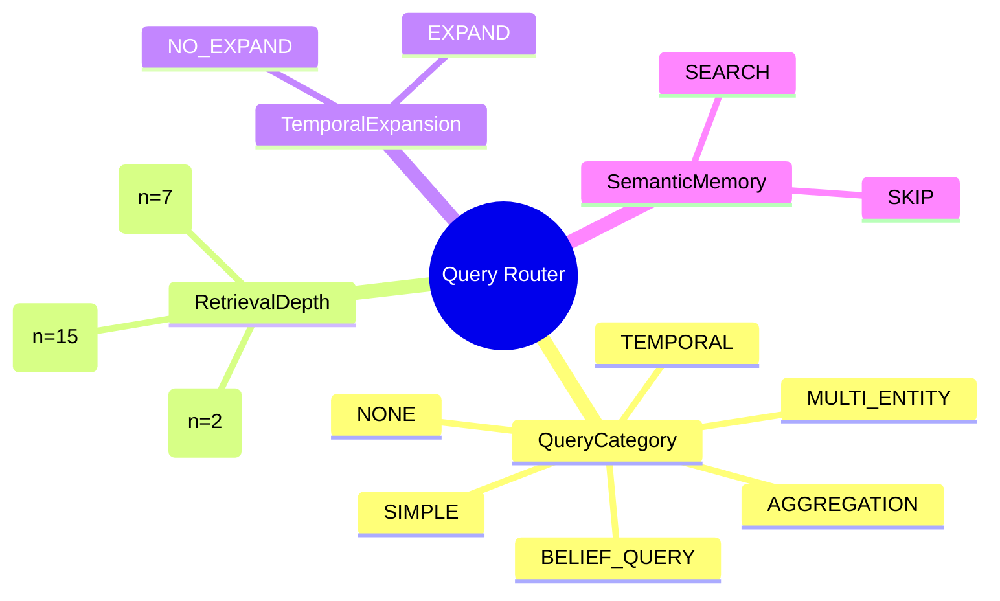
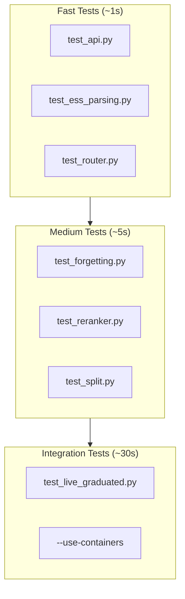

# Test Suite Patterns

> **Deep-Dive Documentation**: Comprehensive reference for unit tests, test patterns, and mocking strategies.

## Overview

The Sonality test suite (`tests/`) provides comprehensive coverage through:

- **Unit tests**: Fast, isolated tests for individual functions
- **Integration tests**: Database-backed tests using testcontainers
- **Mock patterns**: Deterministic LLM testing via canned responses

## Test File Structure

```
tests/
├── conftest.py              # Pytest fixtures (containers, mocks)
├── containers.py            # Testcontainers orchestration
├── test_api.py              # FastAPI endpoint tests
├── test_ess_parsing.py      # ESS classifier parsing tests
├── test_provider_timeout.py # LLM provider timeout tests
├── test_live_graduated.py   # Live integration tests
└── memory/
    ├── test_derivatives.py      # Chunk/derivative tests
    ├── test_forgetting.py       # Memory forgetting tests
    ├── test_segmentation.py     # Episode segmentation tests
    └── retrieval/
        ├── test_chain.py        # Iterative retrieval tests
        ├── test_reranker.py     # LLM reranking tests
        ├── test_router.py       # Query routing tests
        └── test_split.py        # Query decomposition tests
```

## API Endpoint Testing

`tests/test_api.py` demonstrates FastAPI testing patterns with complete mock isolation.

### Test Fixtures

```python
def _make_ess(**kwargs: Any) -> ESSResult:
    """Factory for creating ESSResult with sensible defaults."""
    defaults: dict[str, Any] = {
        "score": 0.55,
        "reasoning_type": ReasoningType.EMPIRICAL_DATA,
        "source_reliability": SourceReliability.UNVERIFIED_CLAIM,
        "internal_consistency": InternalConsistencyStatus.CONSISTENT,
        "novelty": 0.6,
        "topics": ("climate", "energy"),
        "summary": "User asserts that renewable energy reduces emissions.",
        "opinion_direction": OpinionDirection.SUPPORTS,
        "knowledge_density": KnowledgeDensity.MODERATE,
        "belief_update_recommended": True,
        "urgency": UrgencyLevel.STANDARD,
    }
    defaults.update(kwargs)
    return ESSResult(**defaults)


def _make_belief(topic: str = "climate", valence: float = 0.4) -> BeliefNode:
    """Factory for creating BeliefNode with configurable parameters."""
    return BeliefNode(
        topic=topic,
        valence=valence,
        confidence=0.7,
        uncertainty=0.3,
        evidence_count=3,
        belief_text=f"Agent's position on {topic}",
    )
```

### Mock Agent Pattern

```python
@pytest.fixture
def mock_agent() -> MagicMock:
    """Create fully configured mock agent."""
    agent = MagicMock()
    ess = _make_ess()
    beliefs = [_make_belief("climate", 0.4), _make_belief("energy", 0.3)]
    belief_map = {b.topic: b for b in beliefs}

    # Configure method returns
    agent.respond.return_value = "Renewable energy does reduce emissions significantly."
    agent.last_ess = ess
    agent.ingest.return_value = ess
    agent.get_all_beliefs.return_value = beliefs
    agent.get_belief.side_effect = lambda topic: belief_map.get(topic)
    agent.get_health.return_value = (len(beliefs), 5)

    return agent


@pytest.fixture
def client(mock_agent: MagicMock) -> TestClient:
    """TestClient with injected mock agent."""
    _agent_store["agent"] = mock_agent
    yield TestClient(app, raise_server_exceptions=True)
    _agent_store.pop("agent", None)
```

### Test Class Organization



### Coverage Patterns

| Test Class | Happy Path | Error Cases | Edge Cases |
|------------|------------|-------------|------------|
| `TestHealth` | ✓ structure | ✓ 503 no agent | - |
| `TestModels` | ✓ list, get | ✓ 404 unknown | - |
| `TestChatCompletions` | ✓ non-stream, stream | ✓ 400 no user msg, 503 | ✓ multi-turn history |
| `TestSimpleChat` | ✓ ESS metadata | ✓ 503 | - |
| `TestIngest` | ✓ basic | - | ✓ topic override |
| `TestBeliefs` | ✓ all, specific | ✓ 404 unknown | - |

---

## LLM Mocking Pattern

The `mock_llm_call` fixture enables deterministic testing of LLM-dependent code.

### Fixture Implementation

```python
@pytest.fixture
def mock_llm_call(
    monkeypatch: pytest.MonkeyPatch,
) -> Callable[[dict[str, dict[str, object]]], None]:
    """Patch llm_call across all modules that import it."""
    
    def configure(canned: dict[str, dict[str, object]]) -> None:
        def _fake_llm_call(prompt: str, response_model: type, **kwargs):
            # Match prompt substring to canned response
            for key, response in canned.items():
                if key in prompt:
                    return LLMCallResult(
                        success=True,
                        value=response_model.model_validate(response),
                        error=None,
                    )
            # Fallback to kwargs fallback or empty
            fallback = kwargs.get("fallback")
            if fallback:
                return LLMCallResult(success=True, value=fallback, error=None)
            return LLMCallResult(success=False, value=None, error="No match")

        # Patch in all modules that use llm_call
        monkeypatch.setattr("sonality.llm.caller.llm_call", _fake_llm_call)
        monkeypatch.setattr("sonality.memory.retrieval.router.llm_call", _fake_llm_call)
        monkeypatch.setattr("sonality.memory.forgetting.llm_call", _fake_llm_call)
        # ... additional modules

    return configure
```

### Usage Pattern

```python
def test_router_uses_canned_llm_decision(
    mock_llm_call: Callable[[dict[str, dict[str, object]]], None],
) -> None:
    # Configure canned response based on prompt substring matching
    mock_llm_call(
        {
            "Classify this query": {
                "category": "TEMPORAL",
                "depth": "DEEP",
                "temporal_expansion": "EXPAND",
                "semantic_memory": "SKIP",
                "reasoning": "Needs chronology",
            }
        }
    )
    
    # Execute code that calls LLM
    decision = route_query("What changed over time?")
    
    # Assert on deterministic response
    assert decision.category is QueryCategory.TEMPORAL
    assert decision.depth is RetrievalDepth.DEEP
```

### Canned Response Format



---

## Memory Forgetting Tests

`tests/memory/test_forgetting.py` demonstrates async mock patterns for the forgetting subsystem.

### Mock Factory Pattern

```python
def _candidate(uid: str) -> EpisodeNode:
    """Create test episode candidate."""
    return EpisodeNode(
        uid=uid,
        content=f"content {uid}",
        summary=f"summary {uid}",
        topics=["topic"],
        ess_score=0.5,
        created_at="2026-01-01T00:00:00Z",
        valid_at="2026-01-01T00:00:00Z",
    )


def _graph_mock() -> MemoryGraph:
    """Create mock MemoryGraph with async methods."""
    graph = AsyncMock(spec=MemoryGraph)
    graph.archive_episode = AsyncMock()
    graph.delete_episode = AsyncMock()
    return cast(MemoryGraph, graph)


def _store_mock() -> DualEpisodeStore:
    """Create mock DualEpisodeStore with async methods."""
    store = AsyncMock(spec=DualEpisodeStore)
    store.archive_derivatives = AsyncMock()
    store.delete_derivatives = AsyncMock()
    return cast(DualEpisodeStore, store)
```

### Test with LLM Mock

```python
def test_forgetting_uses_full_uid_and_hard_delete_path(
    mock_llm_call: Callable[[dict[str, dict[str, object]]], None],
) -> None:
    # Configure LLM to return FORGET decision
    mock_llm_call(
        {
            "Review these memory candidates for potential archival": {
                "decisions": [
                    {
                        "uid": "episode-aaa",
                        "action": "FORGET",
                        "reason": "Superseded by newer evidence",
                    },
                    {
                        "uid": "unknown-short-id",
                        "action": "ARCHIVE",
                        "reason": "Should be ignored",  # Unknown UID
                    },
                ]
            }
        }
    )

    graph = _graph_mock()
    store = _store_mock()
    
    # Run async function synchronously
    asyncio.run(assess_and_forget(
        [_candidate("episode-aaa"), _candidate("episode-bbb")],
        graph=graph,
        store=store,
        snapshot_excerpt="snapshot",
    ))

    # Verify FORGET triggers hard delete
    cast(AsyncMock, graph.delete_episode).assert_awaited_once_with("episode-aaa")
    cast(AsyncMock, store.delete_derivatives).assert_awaited_once_with("episode-aaa")
    
    # Verify ARCHIVE was NOT called (unknown UID ignored)
    cast(AsyncMock, graph.archive_episode).assert_not_awaited()
```

### Async Test Execution Flow



---

## Retrieval Router Tests

`tests/memory/retrieval/test_router.py` tests the query classification system.

### Router Decision Validation

```python
def test_router_uses_canned_llm_decision(
    mock_llm_call: Callable[[dict[str, dict[str, object]]], None],
) -> None:
    mock_llm_call(
        {
            "Classify this query": {
                "category": "TEMPORAL",
                "depth": "DEEP",
                "temporal_expansion": "EXPAND",
                "semantic_memory": "SKIP",
                "reasoning": "Needs chronology",
            }
        }
    )
    
    decision = route_query("What changed over time?")
    
    # Enum validation
    assert decision.category is QueryCategory.TEMPORAL
    assert decision.depth is RetrievalDepth.DEEP
    assert decision.temporal_expansion is TemporalExpansionDecision.EXPAND
    assert decision.semantic_memory is SemanticMemoryDecision.SKIP
    
    # Derived value
    assert decision.n_results == 15  # DEEP depth maps to 15 results
```

### Decision Space Coverage



---

## Test Execution Commands

### Full Test Suite

```bash
# Run all tests
uv run pytest tests/ -v

# With testcontainers (requires Docker)
uv run pytest tests/ -v --use-containers

# Specific test file
uv run pytest tests/test_api.py -v --tb=short

# Memory subsystem tests
uv run pytest tests/memory/ -v
```

### Coverage Reporting

```bash
# Generate coverage report
uv run pytest tests/ --cov=sonality --cov-report=html

# View coverage
open htmlcov/index.html
```

### Test Categories



---

## Best Practices Summary

| Practice | Example | Benefit |
|----------|---------|---------|
| Factory fixtures | `_make_ess(**kwargs)` | Consistent test data with easy customization |
| Mock injection | `_agent_store["agent"] = mock` | Clean isolation without monkey-patching imports |
| Canned LLM responses | `mock_llm_call({"prompt": response})` | Deterministic LLM behavior |
| AsyncMock + cast | `cast(AsyncMock, mock.method)` | Type-safe async mock assertions |
| Class organization | `class TestHealth:` | Logical grouping by endpoint/feature |
| Error case coverage | `test_503_when_agent_not_initialized` | Explicit failure mode validation |

---

## Related Documentation

- [Testing Infrastructure](testing-infrastructure.md) — Testcontainers setup
- [Benchmark System](benchmark-system.md) — Multi-dimensional evaluation
- [Scenario Runner](scenario-runner.md) — Benchmark execution engine
