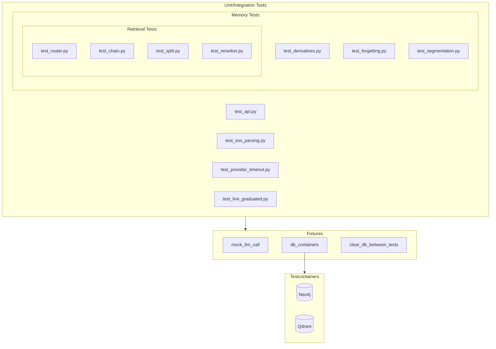

# Testing Framework

This document covers Sonality's testing infrastructure, fixtures, mocking strategies, and testcontainer support.

## Test Suite Overview



## Running Tests

```bash
# Run unit tests (local databases)
pytest tests/

# Run with testcontainers (isolated)
pytest tests/ --use-containers

# Run specific test modules
pytest tests/memory/retrieval/test_router.py

# Run with verbose output
pytest tests/ -v --tb=short
```

## Pytest Configuration

### Command Line Options

```python
def pytest_addoption(parser: pytest.Parser) -> None:
    parser.addoption(
        "--use-containers",
        action="store_true",
        default=False,
        help="Use testcontainers for Neo4j and Qdrant instead of local DBs.",
    )
```

### Session-Scoped Database Containers

```python
@pytest.fixture(scope="session")
def db_containers(pytestconfig: pytest.Config) -> Generator[dict[str, str], None, None]:
    """Session-scoped database containers."""
    if not bool(pytestconfig.getoption("--use-containers")):
        yield NO_DB_CONTAINERS
        return

    from tests.containers import both_containers, patch_config_for_containers

    with both_containers() as config:
        patch_config_for_containers(config)
        yield {
            "qdrant_url": config.qdrant_url,
            "neo4j_url": config.neo4j_url,
            "neo4j_user": config.neo4j_user,
            "neo4j_password": config.neo4j_password,
        }
```

### Auto-Clear Between Tests

```python
@pytest.fixture(autouse=True)
def clear_db_between_tests(db_containers: dict[str, str]) -> Generator[None, None, None]:
    """Clear databases between tests when using containers."""
    yield
    if db_containers:
        asyncio.run(
            clear_databases(
                db_containers["qdrant_url"],
                db_containers["neo4j_url"],
                (db_containers["neo4j_user"], db_containers["neo4j_password"]),
            )
        )
```

## LLM Call Mocking

The `mock_llm_call` fixture patches `llm_call` across all modules with deterministic responses:

```python
@pytest.fixture
def mock_llm_call(monkeypatch: pytest.MonkeyPatch) -> Callable[[dict[str, dict[str, object]]], None]:
    """Patch llm_call with deterministic prompt-keyed responses."""

    responses: dict[str, dict[str, object]] = {}

    def configure(mapping: dict[str, dict[str, object]]) -> None:
        responses.clear()
        responses.update(mapping)

    def fake_call[T: BaseModel](
        *,
        prompt: str,
        response_model: type[T],
        fallback: T,
        **_: object,
    ) -> LLMCallResult[T]:
        for key, response in responses.items():
            if key in prompt:
                return LLMCallResult(
                    value=response_model.model_validate(response),
                    success=True,
                    attempts=1,
                    raw_text=json.dumps(response),
                )
        return LLMCallResult(
            value=fallback,
            success=False,
            error=f"No canned response for prompt: {prompt[:40]}",
            attempts=1,
        )

    # Patch all modules that import llm_call
    targets = (
        "sonality.llm.caller.llm_call",
        "sonality.memory.retrieval.router.llm_call",
        "sonality.memory.retrieval.reranker.llm_call",
        "sonality.memory.retrieval.chain.llm_call",
        "sonality.memory.retrieval.split.llm_call",
        "sonality.agent.llm_call",
        "sonality.memory.belief_provenance.llm_call",
        "sonality.memory.forgetting.llm_call",
        "sonality.memory.knowledge_extract.llm_call",
    )
    for target in targets:
        monkeypatch.setattr(target, fake_call, raising=False)
    return configure
```

### Usage Example

```python
def test_router_classifies_simple_query(mock_llm_call):
    mock_llm_call({
        "Classify this query": {
            "category": "SIMPLE",
            "depth": "MODERATE",
            "temporal_expansion": "NO_EXPAND",
            "semantic_memory": "SKIP",
            "reasoning": "Single topic lookup",
        }
    })
    
    result = route_query("What do you know about X?")
    assert result.category == QueryCategory.SIMPLE
```

## Testcontainers

### Container Configuration

```python
@dataclass
class ContainerConfig:
    """Connection details for running containers."""
    qdrant_url: str
    neo4j_url: str
    neo4j_user: str
    neo4j_password: str
```

### Qdrant Container

```python
@contextmanager
def qdrant_container() -> Generator[str, None, None]:
    """Start a Qdrant container and return connection URL."""
    from testcontainers.qdrant import QdrantContainer

    container = QdrantContainer(image="qdrant/qdrant:latest")
    with container:
        url = f"http://{container.get_container_host_ip()}:{container.get_exposed_port(6333)}"
        if not _wait_for_qdrant(url):
            raise RuntimeError("Qdrant container failed to start")
        asyncio.run(_init_qdrant_schema(url))
        yield url
```

### Neo4j Container

```python
@contextmanager
def neo4j_container() -> Generator[tuple[str, str, str], None, None]:
    """Start a Neo4j container and return (url, user, password)."""
    from testcontainers.neo4j import Neo4jContainer

    container = Neo4jContainer(image="neo4j:5")
    with container:
        url = container.get_connection_url()
        user = "neo4j"
        password = container.password
        if not _wait_for_neo4j(url, (user, password)):
            raise RuntimeError("Neo4j container failed to start")
        _init_neo4j_schema(url, (user, password))
        yield url, user, password
```

### Health Checks

```python
def _wait_for_qdrant(url: str, max_attempts: int = 30) -> bool:
    """Wait for Qdrant to accept connections."""
    for _attempt in range(max_attempts):
        try:
            resp = httpx.get(f"{url}/readyz", timeout=5)
            if resp.status_code == 200:
                return True
        except Exception:
            time.sleep(1)
    return False

def _wait_for_neo4j(url: str, auth: tuple[str, str], max_attempts: int = 30) -> bool:
    """Wait for Neo4j to accept connections."""
    for _attempt in range(max_attempts):
        try:
            driver = GraphDatabase.driver(url, auth=auth)
            with driver.session() as session:
                session.run("RETURN 1").single()
            driver.close()
            return True
        except Exception:
            time.sleep(1)
    return False
```

### Config Patching

```python
def patch_config_for_containers(container_config: ContainerConfig) -> None:
    """Monkey-patch sonality.config with container connection details."""
    import sonality.config as cfg

    object.__setattr__(cfg, "QDRANT_URL", container_config.qdrant_url)
    object.__setattr__(cfg, "NEO4J_URL", container_config.neo4j_url)
    object.__setattr__(cfg, "NEO4J_USER", container_config.neo4j_user)
    object.__setattr__(cfg, "NEO4J_PASSWORD", container_config.neo4j_password)
```

### Database Clearing

```python
async def clear_databases(qdrant_url: str, neo4j_url: str, neo4j_auth: tuple[str, str]) -> None:
    """Clear all data while preserving schema."""
    client = AsyncQdrantClient(url=qdrant_url)
    for collection in Collection:
        if await client.collection_exists(collection):
            await client.delete_collection(collection)
    await init_qdrant_collections(client)
    await client.close()

    driver = GraphDatabase.driver(neo4j_url, auth=neo4j_auth)
    try:
        with driver.session() as session:
            session.run("MATCH (n) DETACH DELETE n")
    finally:
        driver.close()
```

## Test Categories

### Unit Tests

| Module | Tests |
|--------|-------|
| `test_ess_parsing.py` | ESS JSON parsing, field coercion, fallbacks |
| `test_provider_timeout.py` | LLM provider timeout handling |
| `test_derivatives.py` | Semantic chunking |
| `test_segmentation.py` | Boundary detection |

### Integration Tests

| Module | Tests |
|--------|-------|
| `test_api.py` | FastAPI endpoint integration |
| `test_router.py` | Query routing decisions |
| `test_chain.py` | Chain retrieval with sufficiency |
| `test_split.py` | Split retrieval decomposition |
| `test_reranker.py` | LLM listwise reranking |
| `test_forgetting.py` | Archive/forget decisions |

### Live Tests

| Module | Tests |
|--------|-------|
| `test_live_graduated.py` | Full agent integration with LLM |

## Test Patterns

### Mocking LLM Responses

```python
def test_boundary_detection(mock_llm_call):
    mock_llm_call({
        "current_message": {
            "boundary_decision": "BOUNDARY",
            "confidence": 0.9,
            "boundary_type": "topic_shift",
            "reasoning": "New topic introduced",
            "suggested_segment_label": "New discussion",
        }
    })
    
    detector = EventBoundaryDetector()
    detector._recent_messages.append("Previous message")
    result = detector.check_boundary("Completely different topic")
    
    assert result.boundary_decision == BoundaryDecision.BOUNDARY
```

### Testing with Containers

```python
@pytest.mark.usefixtures("db_containers")
def test_episode_storage(db_containers):
    if not db_containers:
        pytest.skip("Requires --use-containers")
    
    agent = SonalityAgent()
    try:
        response = agent.respond([{"role": "user", "content": "Test message"}])
        assert len(response) > 0
    finally:
        agent.shutdown()
```

### Async Test Helpers

```python
def test_async_operation():
    async def run_test():
        store = DualEpisodeStore()
        await store.connect()
        try:
            result = await store.vector_search("test query", top_k=5)
            assert isinstance(result, list)
        finally:
            await store.close()
    
    asyncio.run(run_test())
```

## Dependencies

```toml
[tool.uv.dev-dependencies]
pytest = ">=8.0"
pytest-asyncio = ">=0.23"
testcontainers = {extras = ["neo4j", "qdrant"], version = ">=4.0"}
```
