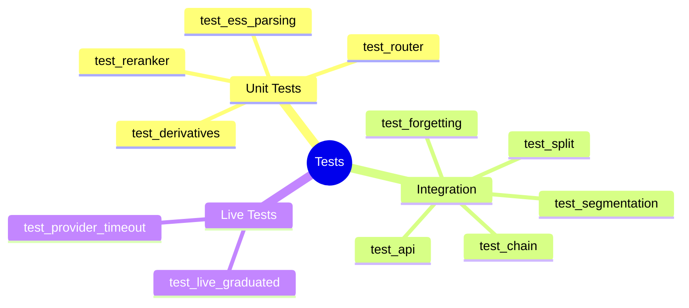
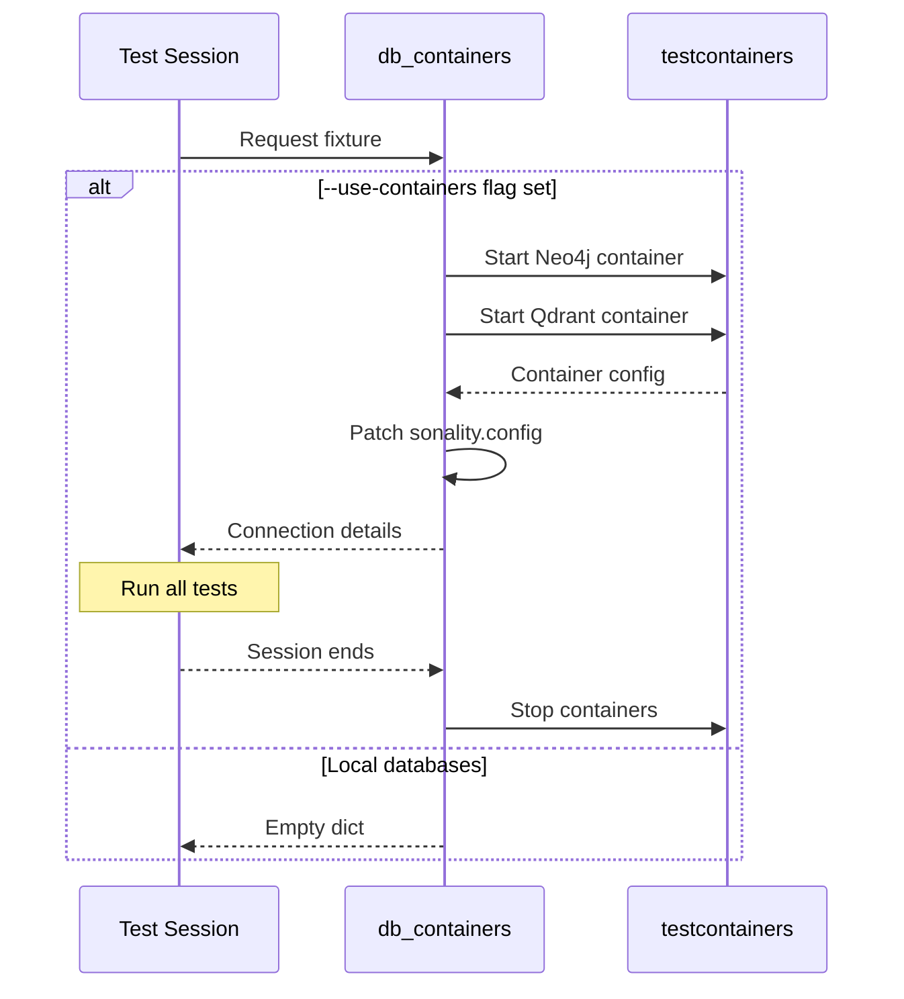

# Testing Infrastructure Deep-Dive

> **Location**: `tests/`  
> **Purpose**: Complete test suite with isolated database testing and LLM mocking

This document provides a comprehensive analysis of the testing infrastructure, including fixtures, mocking strategies, and testcontainers integration.

## Architecture Overview

```
┌─────────────────────────────────────────────────────────────────────────┐
│                       Testing Infrastructure                             │
├─────────────────────────────────────────────────────────────────────────┤
│                                                                         │
│  ┌──────────────────┐  ┌──────────────────┐  ┌──────────────────┐     │
│  │   conftest.py    │  │  containers.py   │  │   Test Files     │     │
│  │                  │  │                  │  │                  │     │
│  │  • pytest hooks  │  │  • Neo4j setup   │  │  • test_api.py   │     │
│  │  • db_containers │  │  • Qdrant setup  │  │  • test_ess*.py  │     │
│  │  • mock_llm_call │  │  • Health checks │  │  • memory/*      │     │
│  │  • clear_db      │  │  • Schema init   │  │  • retrieval/*   │     │
│  └──────────────────┘  └──────────────────┘  └──────────────────┘     │
│                                                                         │
└─────────────────────────────────────────────────────────────────────────┘
```

## Test Categories



## Configuration

### Command-Line Options

```python
def pytest_addoption(parser: pytest.Parser) -> None:
    """Add testcontainers command-line option."""
    parser.addoption(
        "--use-containers",
        action="store_true",
        default=False,
        help="Use testcontainers for Neo4j and Qdrant instead of local DBs.",
    )
```

**Usage:**
```bash
# Use local databases
pytest tests/

# Use isolated containers
pytest tests/ --use-containers
```

## Core Fixtures

### db_containers (Session-Scoped)

```python
@pytest.fixture(scope="session")
def db_containers(pytestconfig: pytest.Config) -> Generator[dict[str, str], None, None]:
    """Session-scoped database containers (only started if --use-containers is set)."""
    if not bool(pytestconfig.getoption("--use-containers")):
        yield NO_DB_CONTAINERS  # Empty dict - use local DBs
        return
    
    from tests.containers import both_containers, patch_config_for_containers
    
    log.info("Starting testcontainers for isolated database testing...")
    with both_containers() as config:
        patch_config_for_containers(config)
        yield {
            "qdrant_url": config.qdrant_url,
            "neo4j_url": config.neo4j_url,
            "neo4j_user": config.neo4j_user,
            "neo4j_password": config.neo4j_password,
        }
```

**Lifecycle:**


### clear_db_between_tests (Auto-Use)

```python
@pytest.fixture(autouse=True)
def clear_db_between_tests(db_containers: dict[str, str]) -> Generator[None, None, None]:
    """Clear databases between tests when using containers."""
    yield  # Let test run
    if db_containers:
        import asyncio
        from tests.containers import clear_databases
        
        asyncio.run(
            clear_databases(
                db_containers["qdrant_url"],
                db_containers["neo4j_url"],
                (db_containers["neo4j_user"], db_containers["neo4j_password"]),
            )
        )
```

**Key Feature**: Auto-use ensures every test starts with clean databases.

### mock_llm_call

```python
@pytest.fixture
def mock_llm_call(
    monkeypatch: pytest.MonkeyPatch,
) -> Callable[[dict[str, dict[str, object]]], None]:
    """Patch llm_call across modules with deterministic prompt-keyed responses."""
    
    responses: dict[str, dict[str, object]] = {}
    
    def configure(mapping: dict[str, dict[str, object]]) -> None:
        responses.clear()
        responses.update(mapping)
    
    def fake_call[T: BaseModel](
        *,
        prompt: str,
        response_model: type[T],
        fallback: T,
        **_: object,
    ) -> LLMCallResult[T]:
        # Match prompt substring to canned response
        for key, response in responses.items():
            if key in prompt:
                return LLMCallResult(
                    value=response_model.model_validate(response),
                    success=True,
                    attempts=1,
                    raw_text=json.dumps(response),
                )
        # No match: return fallback
        return LLMCallResult(
            value=fallback,
            success=False,
            error=f"No canned response for prompt: {prompt[:40]}",
            attempts=1,
            raw_text="",
        )
    
    # Patch all modules that use llm_call
    targets = (
        "sonality.llm.caller.llm_call",
        "sonality.memory.retrieval.router.llm_call",
        "sonality.memory.retrieval.reranker.llm_call",
        "sonality.memory.retrieval.chain.llm_call",
        "sonality.memory.retrieval.split.llm_call",
        "sonality.agent.llm_call",
        "sonality.memory.belief_provenance.llm_call",
        "sonality.memory.forgetting.llm_call",
        "sonality.memory.knowledge_extract.llm_call",
    )
    for target in targets:
        monkeypatch.setattr(target, fake_call, raising=False)
    
    return configure
```

**Usage Example:**
```python
def test_router_simple_query(mock_llm_call):
    mock_llm_call({
        "Classify this query": {
            "category": "SIMPLE",
            "depth": "MODERATE",
            "temporal_expansion": "NO_EXPAND",
            "semantic_memory": "SKIP",
            "reasoning": "Single topic lookup"
        }
    })
    
    decision = route_query("What do you know about Python?")
    assert decision.category == QueryCategory.SIMPLE
```

## Container Management

### ContainerConfig

```python
@dataclass
class ContainerConfig:
    """Connection details for running containers."""
    qdrant_url: str
    neo4j_url: str
    neo4j_user: str
    neo4j_password: str
```

### Container Startup

```python
@contextmanager
def qdrant_container() -> Generator[str, None, None]:
    """Start a Qdrant container and return connection URL."""
    from testcontainers.qdrant import QdrantContainer
    
    log.info("Starting Qdrant container...")
    container = QdrantContainer(image="qdrant/qdrant:latest")
    with container:
        url = f"http://{container.get_container_host_ip()}:{container.get_exposed_port(6333)}"
        if not _wait_for_qdrant(url):
            raise RuntimeError("Qdrant container failed to start")
        asyncio.run(_init_qdrant_schema(url))
        log.info("Qdrant container ready at %s", url)
        yield url

@contextmanager
def neo4j_container() -> Generator[tuple[str, str, str], None, None]:
    """Start a Neo4j container and return (url, user, password)."""
    from testcontainers.neo4j import Neo4jContainer
    
    log.info("Starting Neo4j container...")
    container = Neo4jContainer(image="neo4j:5")
    with container:
        url = container.get_connection_url()
        user = "neo4j"
        password = container.password
        auth = (user, password)
        if not _wait_for_neo4j(url, auth):
            raise RuntimeError("Neo4j container failed to start")
        _init_neo4j_schema(url, auth)
        log.info("Neo4j container ready at %s", url)
        yield url, user, password
```

### Health Checks

```python
def _wait_for_qdrant(url: str, max_attempts: int = 30) -> bool:
    """Wait for Qdrant to accept connections."""
    for _attempt in range(max_attempts):
        try:
            resp = httpx.get(f"{url}/readyz", timeout=5)
            if resp.status_code == 200:
                return True
        except Exception:
            time.sleep(1)
    return False

def _wait_for_neo4j(url: str, auth: tuple[str, str], max_attempts: int = 30) -> bool:
    """Wait for Neo4j to accept connections."""
    for _attempt in range(max_attempts):
        try:
            driver = GraphDatabase.driver(url, auth=auth)
            with driver.session() as session:
                session.run("RETURN 1").single()
            driver.close()
            return True
        except Exception:
            time.sleep(1)
    return False
```

### Schema Initialization

```python
async def _init_qdrant_schema(url: str) -> None:
    """Initialize Qdrant collections for testing."""
    client = AsyncQdrantClient(url=url)
    await init_qdrant_collections(client)
    await client.close()

def _init_neo4j_schema(url: str, auth: tuple[str, str]) -> None:
    """Initialize Neo4j schema for testing."""
    driver = GraphDatabase.driver(url, auth=auth)
    try:
        with driver.session() as session:
            for stmt in NEO4J_SCHEMA_STATEMENTS:
                session.run(stmt)
    finally:
        driver.close()
```

### Database Clearing

```python
async def clear_databases(qdrant_url: str, neo4j_url: str, neo4j_auth: tuple[str, str]) -> None:
    """Clear all data from both databases while preserving schema."""
    # Clear Qdrant
    client = AsyncQdrantClient(url=qdrant_url)
    for collection in Collection:
        if await client.collection_exists(collection):
            await client.delete_collection(collection)
    await init_qdrant_collections(client)  # Recreate empty
    await client.close()
    
    # Clear Neo4j
    driver = GraphDatabase.driver(neo4j_url, auth=neo4j_auth)
    try:
        with driver.session() as session:
            session.run("MATCH (n) DETACH DELETE n")
    finally:
        driver.close()
```

### Config Patching

```python
def patch_config_for_containers(container_config: ContainerConfig) -> None:
    """Monkey-patch sonality.config with container connection details."""
    import sonality.config as cfg
    
    object.__setattr__(cfg, "QDRANT_URL", container_config.qdrant_url)
    object.__setattr__(cfg, "NEO4J_URL", container_config.neo4j_url)
    object.__setattr__(cfg, "NEO4J_USER", container_config.neo4j_user)
    object.__setattr__(cfg, "NEO4J_PASSWORD", container_config.neo4j_password)
```

## Test File Structure

```
tests/
├── conftest.py              # Fixtures and hooks
├── containers.py            # Testcontainers support
├── test_api.py              # FastAPI endpoint tests
├── test_ess_parsing.py      # ESS enum parsing
├── test_live_graduated.py   # Live LLM integration
├── test_provider_timeout.py # Timeout handling
└── memory/
    ├── test_derivatives.py  # Chunking tests
    ├── test_forgetting.py   # Forgetting system
    ├── test_segmentation.py # Boundary detection
    └── retrieval/
        ├── test_chain.py    # Chain retrieval
        ├── test_reranker.py # Reranking
        ├── test_router.py   # Query routing
        └── test_split.py    # Split retrieval
```

## Test Patterns

### Unit Test Pattern

```python
def test_enum_parsing():
    """Test enum coercion without external dependencies."""
    from sonality.ess import _parse_enum, ReasoningType, REASONING_TYPE_ALIASES
    
    result, coerced = _parse_enum(
        ReasoningType, "logical", ReasoningType.NO_ARGUMENT, REASONING_TYPE_ALIASES
    )
    assert result == ReasoningType.LOGICAL_ARGUMENT
    assert not coerced
```

### Mocked LLM Test Pattern

```python
def test_router_belief_query(mock_llm_call):
    """Test routing with mocked LLM response."""
    mock_llm_call({
        "Classify this query": {
            "category": "BELIEF_QUERY",
            "depth": "MODERATE",
            "temporal_expansion": "NO_EXPAND",
            "semantic_memory": "SEARCH",
            "reasoning": "Asking about agent's opinion"
        }
    })
    
    decision = route_query("What do you think about AI?")
    
    assert decision.category == QueryCategory.BELIEF_QUERY
    assert decision.semantic_memory == SemanticMemoryDecision.SEARCH
```

### Integration Test Pattern

```python
@pytest.mark.asyncio
async def test_dual_store_with_containers(db_containers):
    """Test dual store with real databases."""
    if not db_containers:
        pytest.skip("Requires --use-containers")
    
    db = await DatabaseConnections.create()
    embedder = Embedder()
    graph = MemoryGraph(db.neo4j_driver)
    store = DualEpisodeStore(graph, db.qdrant, embedder)
    
    result = await store.store(
        user_message="Test message",
        agent_response="Test response",
        summary="Test summary",
        topics=["test"],
        ess_score=0.5,
    )
    
    assert result.episode_uid
    assert len(result.derivative_uids) > 0
    
    await db.close()
```

## Running Tests

```bash
# Run all unit tests (fast, no external deps)
pytest tests/ -v

# Run with isolated containers
pytest tests/ --use-containers -v

# Run specific test file
pytest tests/memory/test_forgetting.py -v

# Run with coverage
pytest tests/ --cov=sonality --cov-report=html

# Run live tests (requires running LLM)
pytest tests/test_live_graduated.py -v --live
```

## Related Documentation

- [Testing Framework](testing-framework.md) - Overview of testing approach
- [Benchmarks](benchmarks.md) - Performance and behavioral benchmarks
- [Database Schema](../architecture/database-schema.md) - Schema definitions
